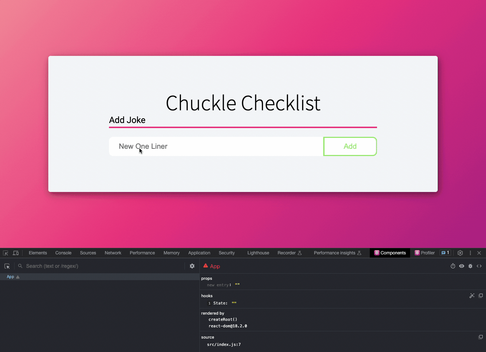

# Creating a New One Liner
In this chapter you will begin fleshing out the jsx of this application and add the functionality to create a new one liner.



## Add the header for the application
   
   > ***Before you get started***: Open up the `App.css` module and read the comment in there titled, _"APP CUSTOM STYLES"_

## Capture the user input
  
Add a text input to your JSX and _capture_ the user's input. What can be used to _store_ the user's input? How do we _capture_ the user's input? Here's some code for the input to get you started: 

```jsx
<input
  className=""
  type="text"
  placeholder="New One Liner"
  onChange={(event) => {
    // What's the value of event?
  }}
/>
```

<details>
   <summary>💡Where's the user's input?</summary>

   Try console logging the event in the onChange. The target property on that event is _what_ the user interacted with. In this case the user is interacting with the input element. We want to get the _value_ of the input element in order to capture what the user has typed.
</details>


<details>
   <summary>💡 Where do we store the user's input?</summary>

   Let's declare a new state variable to store the user's input! When the user types into that input field, update the state with the user's new joke.
</details>


## Save the user input

Start by adding a `jokeService` module to your services directory. Add a function here for Posting a new joke.

Now add a button for posting the new joke. When the user clicks on the button, a new joke with the text the user inputted should be added to the database. All new jokes added to the database should have the `told` property set to `false`. 

## Clear the input field 

Yay! We can add new jokes! But our user experience is lacking a little. We want our input field to clear once the joke has been posted. How can we do this? Currently, our input field modifies our state every time it changes, so our state is _tied to our input field_. Is there a way to _tie our input field to our state_? Try adding a `value` attribute on the `input` element. We can manually set the value of an input field this way.

<details>
  <summary>💡 Still stuck?</summary>

  After the new joke is posted to the database, reset the state that holds the user's input to an empty string. We don't need it to hold that new joke anymore. Now set the `value` attribute on the `input` to the state. This way the value of the `input` will always be whatever the value of the state is. Therefore when you clear the state, you will also clear the input.
</details>

## Optional Fun!

Would you like the Head Coach of Dad Jokes to be the logo of your app? If so, follow the steps below: 

1. Download [this photo](./images/steve.png) and add it to the `assets` folder of your application. 
2. Import the picture into your `App.jsx` module.
   ```javascript
   import stevePic from "./assets/steve.png"
   ```
3. Paste this code inside your `app-heading` div (if you're using the styles given to you) and above the "Chuckle Checklist" heading. 
   ```javascript
   <div className="app-heading-circle">
      
    </div>
   ```
4. Add these styles as substyles in the `.app-heading` style. _Make sure they're not inside the `.app-heading-text` style._
    ```css
    .app-heading-circle {
      background: var(--col-2);
      width: 7rem;
      height: 7rem;
      border-radius: 50%;
      display: flex;
      justify-content: center;
      align-items: center;
      color: white;
      font-size: 4rem;
      box-shadow: 2px 4px 10px hsla(0, 0%, 0%, 0.3),
        2px 4px 20px hsla(0, 0%, 0%, 0.2);

      .app-logo {
        width: 5rem;
        filter: drop-shadow(1px 1px 11px var(--col-0));
      }
    }
    ```
5. You should be good to go!

Up Next: [Reading chuckles](./CHUCKLE_READ.md)