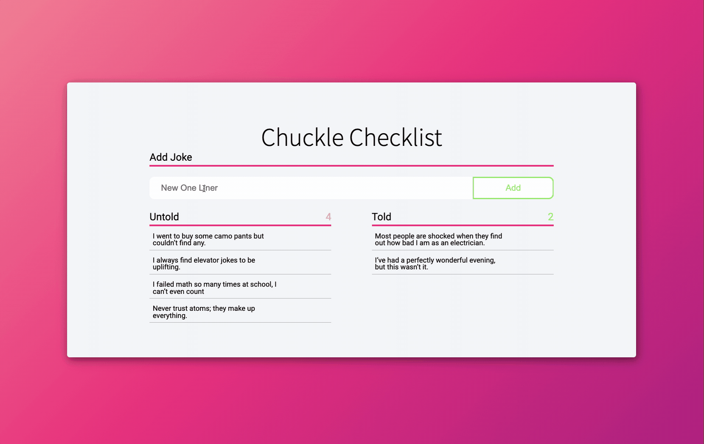

# Listing the Jokes
In this chapter you will get all the jokes and separate them into two lists, as well as display the count for both lists.



## Jokes State

We're going to add three new state variables. One to store all of our jokes - `allJokes`, one to store the untold jokes - `untoldJokes`, and one to store the told jokes - `toldJokes`.

First, let's get all of our jokes from the database and store them in state. _Remember not to trigger an infinite loop!_ Check your react dev tools to see if you've successfully stored the jokes in `allJokes` and watch your network tab to make sure your not making endless fetch calls. 

<details>
  <summary>Troubleshooting</summary>

  ***Infinite loop?*** Remember that when state changes, it triggers a rerender of the component. Re-read chapter five of Honey Rae's to learn how to fix this.
</details>

### Untold vs Told

Now let's populate `toldJokes` and `untoldJokes`! 
Once `allJokes` contains our array of jokes, filter `allJokes` and set `untoldJokes` and `toldJokes` with the correct jokes.

#### Didja get that?

<details>
  <summary>Troubleshooting</summary>
  
  ***Still empty arrays?*** Setting state with the setter function isn't instantaneous. The component has to rerender before updating the new state. If you tried filtering allJokes and setting the other two state variables on the line after setting `allJokes`, you're gonna be setting those with an empty array. You need to watch for when the value of `allJokes` changes, this when you'll know it's been set. Re-read chapter five of Honey Rae's to learn how to do this.
</details>

## Displaying the Jokes

Now it's time to get those on the page! But don't stop there, add a count for each list to show how many joke are either told or untold.

### Adding a New Joke

Try adding a new joke now. Hmmmmm. Not getting your new joke in the list? You've posted to the database, but your `allJokes` state still has the old list of jokes. You'll need to re-fetch those bad boys after you've successfully posted a new one. 


<details>
  <summary>Once you've finished that, check this out</summary>

  The next two chapters will involve updating the database, so we'll end up running this code:
  ```javascript
  getJokes().then((jokeArr) => {
      setAllJokes(jokeArr)
  })
  ```
  quite a few times. Try wrapping it in it's own function so you can just call it whenever you need to fetch and set all jokes instead of writing this functionality over and over again. 
</details>

Up Next: [Editing chuckles](./CHUCKLE_UPDATE.md)