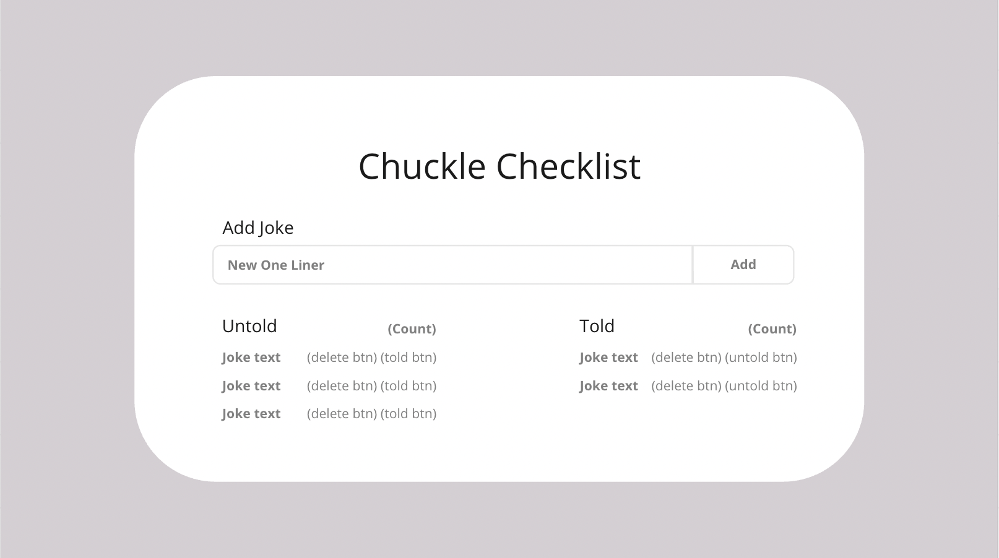

# Chuckle Checklist
>You’re the funniest person you know, and your specialty is one-liners. You like to keep your adoring audience on their toes, but you have a hard time keeping track of which one-liners your friends have had the pleasure of hearing and which ones are still waiting to force the air out of their nose. That’s why you decided to create an app that will track them for you! You want the ability to record a new one-liner as soon as you think of it and track which ones have been told and which one's haven't.

## The Project
This a fairly simple application designed to help you practice some of the basics of React that you learned while building Honey Rae's.

It has a simple database and full CRUD functionality. Here's what you'll be building throughout these chapters:



This application involves **C**reating, **R**eading, **U**pdating, and **D**eleting a One Liner from the database.

### Learning Objectives
After building this application, you should have a deepened understanding of: ***JSX***, handling ***events***, ***useState***, and ***useEffect***

### Setup

Run the following commands _one at a time_ to do the basic software package installations

```shell
cd ~/workspace
npm create vite@latest chuckle-checklist -- --template react
cd chuckle-checklist
npm install
```

We're going to give you some boilerplate code for your Chuckle Checklist application. Run the following command in your terminal:

```shell
/bin/bash -c "$(curl -fsSL https://raw.githubusercontent.com/nashville-software-school/course-bash-scripts/main/client/chuckle-setup.sh)"
```

### Data
You'll need a database to store your awesome one liners. Follow the steps to get it set up.

```shell
cd ~/workspace
mkdir chuckle-api
cd chuckle-api
touch database.json
```

Here's some one liners to get you started. Copy the JSON data below and paste it into your database file.

<details>
    <summary>Expand to get your data</summary>

```json
{
  "jokes": [
    {
      "id": 1,
      "text": "I went to buy some camo pants but couldn’t find any.",
      "told": false
    },
    {
      "id": 2,
      "text": "I always find elevator jokes to be uplifting.",
      "told": false
    },
    {
      "id": 3,
      "text": "Most people are shocked when they find out how bad I am as an electrician.",
      "told": true
    },
    {
      "id": 4,
      "text": "I’ve had a perfectly wonderful evening, but this wasn’t it.",
      "told": false
    },
    {
      "id": 5,
      "text": "I failed math so many times at school, I can’t even count",
      "told": true
    }
  ]
}
```


Up Next: [Creating chuckles](./CHUCKLE_CREATE.md)