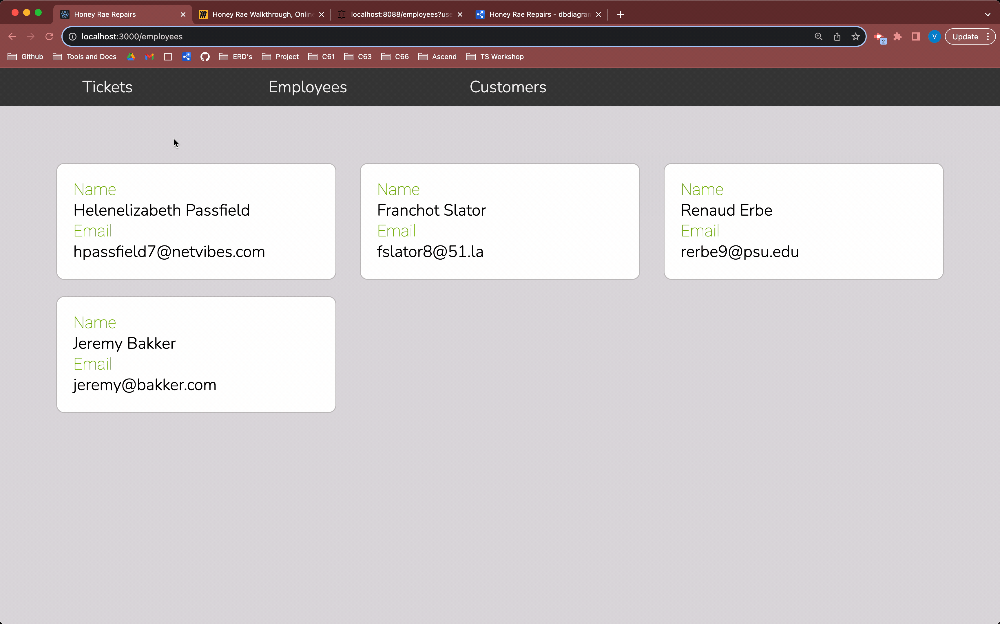

# Customer Details View

## 📺 Watch The Videos

### ⚠️ Note on the video: 
This video instructs you to make the file `components/customers/CustomerDetails.js`. Make sure your file ends in `.jsx` instead of `.js`.

First, watch the introduction to the [useParams hook](https://youtu.be/fPfQ4JjPQps?si=BvCeRUgf9YvKZpkD) video and implement the code yourself. Next, watch the [Customer Details](https://youtu.be/aiVEFIHDj4k?si=32JIaDbJwxbJ1P3I) video and implement the code yourself. Then read the rest of the chapter summarizing what you've learned.

### 🔸🔻🔹 CSS for this chapter
<details>
  <summary>Welcome.css</summary>

  ```css
  .welcome-container {
    margin: 2rem auto;
    width: 60%;
    text-align: center;
    padding: 5rem 3rem;
    border: 1px solid var(--outline);
    background-color: white;
    border-radius: 0.5rem;
  }

  /* This targets any h1 that is a child of an element with the .welcome-container class */
  .welcome-container > h1 {
    display: flex;
    flex-direction: column;
    color: var(--primary);
  }

  /* This targets any div that is a child of an element with the .welcome-container class */
  .welcome-container > div {
    font-style: italic;
  }
  ```
</details>

<details>
  <summary>User.css</summary>

  ```css
  .user:hover {
    -webkit-transform: scale(1.1);
    -ms-transform: scale(1.1);
    transform: scale(1.1);
  }
  ```
</details>

<details>
  <summary>Customer.css</summary>

  ```css
  section.customer {
    margin: 3rem;
  }

  .customer {
    background-color: var(--white);
    border: 1px solid var(--outline);
    border-radius: 0.5rem;
    padding: 1rem;
  }

  .customer-info {
    color: var(--info);
    font-family: "Roboto", sans-serif;
  }

  .customer-header {
    font-size: larger;
    font-weight: 700;
    line-height: 3rem;
    color: var(--primary);
  }
  ```
</details>

<details>
  <summary>Employee.css</summary>

  ```css
  .employee {
    background-color: var(--white);
    border: 1px solid var(--outline);
    border-radius: 0.5rem;
    padding: 1rem;
  }

  section.employee {
    margin: 3rem;
  }

  .employee-info {
    color: var(--info);
    font-family: "Roboto", sans-serif;
  }

  .employee-footer {
    margin: 1rem 0 0.25rem 0;
    font-style: oblique;
  }

  .employee-header {
    font-size: larger;
    font-weight: 700;
    line-height: 3rem;
    color: var(--primary);
  }
  ```
</details>

## Index Route
The index route makes it _even_ easier to organize and set up our routes! Let's take a look at two examples fo routes we can simplify with nesting and using and `index` route. Let's say we've set up the following routes for our application. We also want each view to display the same header and footer. 

```jsx
<Routes>
  <Route 
    path="/" 
    element={
      <>
        <Header />
        <Welcome />
        <Footer />
      </>
    } 
  />
  <Route 
    path="/about" 
    element={
      <>
        <Header />
        <About />
        <Footer />
      </>
    } 
  />
  <Route 
    path="/contact" 
    element={
      <>
        <Header />
        <Contact />
        <Footer />
      </>
    } 
  />
</Route>
```

Let's simplify this by nesting these routes and setting up an index route for the Welcome component. What's the common denominator for all of these routes? They all start at `/`, and they all have a `<Header />` and `<Footer />` component rendered with them. 

```jsx
<Routes>
  <Route 
    path="/">
    element={
      <Header />
      <Outlet /> {/*This is where the child route element will render*/}
      <Footer />
    }
  >
    <Route index element={<Welcome />} /> {/* This will render at / */}
    <Route path="about" element={<AboutUs />} /> {/* This will render at /about */}
    <Route path="contact" element={<ContactUs />}/> {/* This will render at  /contact */}
  </Route>
</Routes>
```

We were able to nest all these routes under a parent route for `/`. Now when the url of this app hits any of the child routes, they will render in the `<Outlet />` of the parent route between the `<Header />` and `<Footer />`. When, and _only_ when, the app url is at `/`, the child index route will render the `<Welcome />` component. 

Let's look at another example by adding some more routes to this app.

```jsx
<Routes>
  <Route 
    path="/">
    element={
      <Header />
      <Outlet /> {/*This is where the child route element will render*/}
      <Footer />
    }
  >
    <Route index element={<Welcome />} /> {/* This will render at / */}
    <Route path="about" element={<AboutUs />} /> {/* This will render at /about */}
    <Route path="contact" element={<ContactUs />}/> {/* This will render at  /contact */}
    <Route path="projects" element={<Projects />} /> {/* This will render at  /projects */}
    <Route path="projects/teams" element={<ProjectTeams />} /> {/* This will render at  /projects/teams */}
    <Route path="projects/technologies" element={<ProjectTechs />} /> {/* This will render at  /projects/technologies */}
  </Route>
</Routes>
```

Let's try nesting these new routes. What's the common denominator between them? They all render at `/projects`. Let's make `/projcets` the parent route. There is no common component we want to share between them all (besides the `<Header />` and `<Footer />` that is already added to them via the uppermost parent component.) _However_ we **do** want to render the `<Projects />` list when the url is at the `/projects` parent route. Therefore, we wont need to add an element to the parent component, but we will include an `index` route for the `<Projects />` component.

```jsx
<Routes>
  <Route 
    path="/">
    element={
      <Header />
      <Outlet /> {/*This is where the child route element will render*/}
      <Footer />
    }
  >
    <Route index element={<Welcome />} /> {/* This will render at / */}
    <Route path="about" element={<AboutUs />} /> {/* This will render at /about */}
    <Route path="contact" element={<ContactUs />}/> {/* This will render at  /contact */}
    <Route path="projects"> 
      <Route index element={<Projects />} /> {/* This will render at  /projects */}
      <Route path="teams" element={<ProjectTeams />} /> {/* This will render at  /projects/teams */}
      <Route path="technologies" element={<ProjectTechs />} /> {/* This will render at  /projects/technologies */}`
    </Route>
  </Route>
</Routes>
```

## Route Parameters and the useParams() hook
Route parameters enable us to include specific pieces of information, like an `id`, in our URL. The `useParams` hook gives us a way to retrieve that information within the component that corresponds to that URL. Building on the example provided earlier, let's consider implementing a route for viewing the details of a particular project. We'll establish a new Route that incorporates the project's id (for instance, `/projects/2`). As the app navigates to this URL, we'll render a component tailored to displaying the details of a specific project.

```jsx
<Routes>
  <Route 
    path="/">
    element={
      <Header />
      <Outlet /> 
      <Footer />
    }
  >
    <Route index element={<Welcome />} />
    <Route path="about" element={<AboutUs />} />
    <Route path="contact" element={<ContactUs />}/>
    <Route path="projects"> 
      <Route index element={<Projects />} />
      <Route path="teams" element={<ProjectTeams />} />
      <Route path="technologies" element={<ProjectTechs />} />
      <Route path=":projectId" element={<ProjectDetails />} /> {/* This will render at /projects/[some-id] */}
    </Route>
  </Route>
</Routes>
```

In order to access that id in the `ProjectDetails` component, we utilize the `useParams()` hook from react-router-dom.

```jsx
export const ProjectDetails = () => {
  const { projectId } = useParams()

  return (
    <div>Project #{projectId}</div>
  )
}
```
Let's say the the user navigates to `www.someapp.com/projects/2`.

In the `Route` above, we defined our route parameter as `projectId`. When the user visits this path, `ProjectDetails` component is rendered. Within this component, we use the `useParams` hook, which returns an object containing the `projectId` as a key with the value `3`. By deconstructing this object, we retrieve the `projectId` and display it within a `div`. As a result, the user sees "Project #3" displayed on the page.

### More on Route Params
We can place a route parameter anywhere in the url, as long as it's prefaced with a `:`

```jsx
<Route path="projects"> 
  <Route index element={<Projects />} />
  <Route path=":projectId" element={<ProjectDetails />} /> 
  <Route path="edit/:projectId" element={<EditProject />} />
</Route>
```

In the `EditProject` route above, we defined another route parameter as `projectId` just like we did in the `ProjectDetails` route. When the url of the application is `/projects/edit/4`, the `EditProject` component will render. In the `EditProject` component, we can once again access the route parameter via the `useParams` hook. 

```jsx
export const EditProject = () => {
  const { projectId } = useParams()

  return (
    <div>Project #{projectId}</div>
  )
}
```

# 💪 Exercise Time!
Time to code to learn! Write the routing functionality for the Employees Details. When the user clicks on an Employee in the Employees List, the user should be directed to _/employees/[the id of the user that was clicked on]_ and the employee's details should render.  




### Hints
<details>
  <summary>💡 App.jsx</summary>

  ### The Route
  Add a new `Route` for the employee details. Set up a route param to capture the `userId` of the employee.

  <details>
    <summary>Still stuck? Here's one way to implement</summary>


```jsx
  <Route path="employees">
    <Route index element={<EmployeeList />} />
    <Route path=":employeeId" element={<EmployeeDetails />} />
  </Route>
```
  </details>
</details>

<br>

<details>
  <summary>💡 EmployeeList.jsx</summary>

  ### The Link
  Wrap the user component with a `Link` component. The link should navigate to the the new route you set up. Use string interpolation to add the id to the `to` path for the link. 

  <details>
    <summary>Still stuck? Here's one way to implement</summary>


```jsx
  return (
  <div className="employees">
    {employees.map((employeeObj) => {
      return (
        <Link to={`/employees/${employeeObj.id}`} key={employeeObj.id}>
          <User user={employeeObj} key={employeeObj.id} />
        </Link>
      )
    })}
  </div>
)
```
  </details>
</details>

<br>

<details>
  <summary>💡 EmployeeDetails.jsx</summary>
  
  ### Get the id
  Capture the id from the url using the `useParams` hook. Remember the key on the returned object is the route parameter you defined when setting up the `Route` in `App.js`.

  ### Render the details
  Get that employee from the database! You'll need to define a new function in the `employeeService.js` module to get the employee by id. Keep in mind all the details we want to display for the employee. All that's left is to display those deets in the jsx. 
</details>

<br>

<details>
  <summary>💡 EmployeeService.js</summary>

  ### The url
  We're wanting to display _all_ the information for the employee, therefore we'll want to get the employee object from the database and expand the user object. This way you will have access to the `specialty`, `rate`, `fullName`, and `email` for the employee. In the `EmployeeDetails` component where you'll be invoking this function, you'll have the `userId`. You'll want to add an additional query to this url to get the employee by the `userId`. Lastly, we want to see how many tickets this employee is working on. Looking at the ***ERD***, this information can be gathered from the `EmployeeTickets` table. Add one last query to `embed` the `EmployeeTickets` on this employee object.

  <details>
    <summary>Still stuck? Here's the url</summary>

```javascript
`http://localhost:8088/employees?userId=${id}&_expand=user&_embed=employeeTickets`
```
  </details>
</details>

<br>

**Copy and pasting is _boring_**

## 📓 Vocabulary 
> **Index Route:** The child Route we want to render at the path of the parent Route. Consider it the "default" child Route.

> **Route Params:**  Placeholders in the URL that begin with a colon `:`. 

> **usePrams:** A hook from the react-router-dom library that returns the route parameter as a key/value pair on an object. The key being the route parameter defined for the Route that rendered the component and the value being the value in the url at the position the route parameter was defined. 

Up Next: [Introducing authentication](./REPAIR_CLAIM_VS_CLOSE.md)