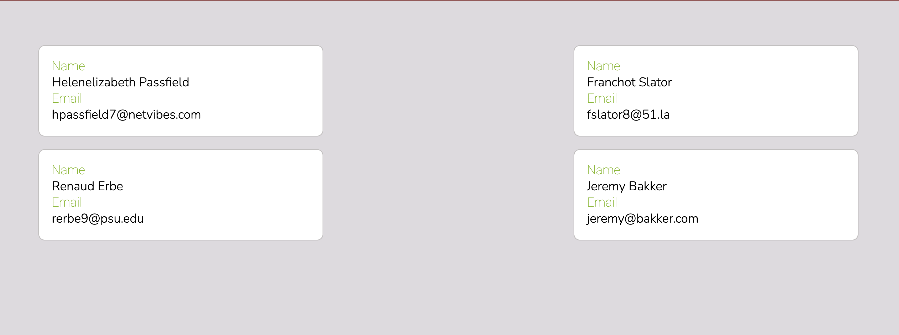

# Listing The Employees
In this chapter you will implement the Employee list the same way we did the Customer list.

### Expected Outcome:


## ⚠️ BEFORE YOU START ⚠️
The goal of this exercises is _not_ to get the employees rendered on the page. The goal is to deepen your understanding by putting to practice what you've learned so far. The _outcome_ will be the employees rendered on the page. That being said...

### DO NOT copy and paste code from the previous chapter.

This will not lead to understanding. If you get stuck, go back and read the chapters. If you're still stuck, check out the hints below. If you must look to the customer list code, do so only to remind yourself of the syntax and then type it out instead of copying and pasting. 

Once you've successfully rendered the employees on the page, feel free to compare your JSX to the JSX for the CustomerList to get the classes and layout right. 

### 🔸🔻🔹 CSS for this chapter
<details>
  <summary>Employees.css</summary>

  ```css
    .employees {
      display: flex;
      flex-direction: row;
      flex-wrap: wrap;
      justify-content: space-between;
      margin: 3rem;
    }

    .employees > * {
      flex-basis: 31%;
      margin: 0.5rem;
    }
  ```
</details>

### Completely Stuck?
<details>
  <summary>Steps to implement.</summary>

  1. Add function to userService to get staff users
  2. Create employees directory and add EmployeeList module
  3. Create Employees.css module and import to EmployeeList
  4. Create EmployeeList component
  5. Create a state variable to store the employees
  6. Get the employees on the initial render
  7. Map the employees in the JSX
  8. For each employee, render the User component and pass the employee to the user prop
  9.  Render the EmployeeList component in the App component
</details>

## 🧭 ***Explorer Exercise :*** 😂🗒 Chuckle Checklist Components
Now that you understand how to pass props and render components, see if you can break up the Chuckle Checklist code into smaller components. Currently, all the code and functionality for the application is in `App.jsx`. Can any of the code be reused? What props would the new components need? There's no right or wrong way of doing this. Have fun with it and as always, ***don't be afraid to break something!***

Up Next: [Introducing Learning Moments](./LEARN_SETUP.md)