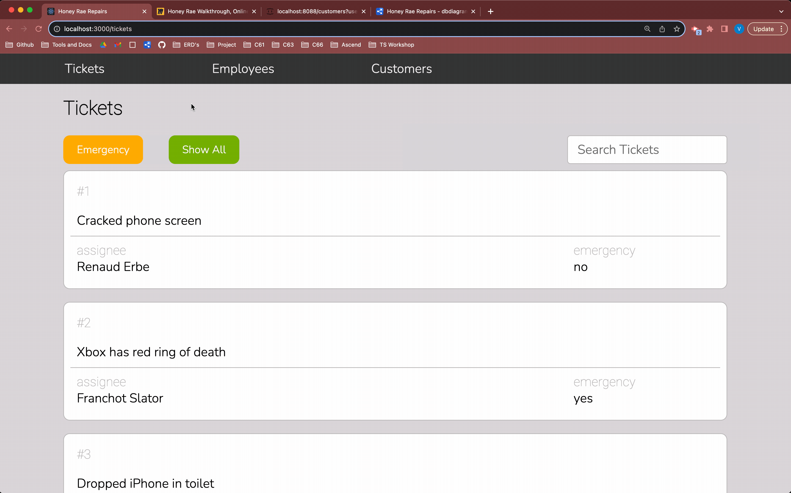

# Introducing Routes In Your Application
In order to include routing functionality in our application, we need to install a third-party library called _React-Router-Dom_.

In the root of your application run the following command:
```shell
npm install --save react-router-dom
```

## 📺 Watch The Video

### ⚠️ Note on the video: 
This video instructs you to make the files`components/nav/NavBar.js` and `components/users/User.js`. Make sure your files end in `.jsx` instead of `.js`.

Watch the [Intro to Routes](https://youtu.be/IIb47gZBFbY?si=_ZhOwvEDdOQL_3y1) video and implement the code yourself. Then read the rest of the chapter summarizing what you've learned.

### 🔸🔻🔹 CSS for this chapter
<details>
  <summary>NavBar.css</summary>

  ```css
    .navbar {
      display: flex;
      flex-wrap: nowrap;
      background-color: var(--dark);
      margin: 0;
      width: 100%;
      padding: 0.5rem;
    }

    .navbar-item {
      flex-basis: 20%;
      list-style-type: none;
      text-align: center;
      color: var(--offWhite);
    }

    .navbar-link {
      text-decoration: none;
      font-family: "Quicksand", sans-serif;
      letter-spacing: 1px;
    }

    .navbar-logout {
      margin-left: auto;
    }

    .navbar-link:hover {
      color: var(--primary);
    }
  ```
</details>

## Setting Up Routes
In the video you learned how to set up up routes for your application. 

We started off by wrapping our entire application with the `<BrowserRouter>` component. This keeps our application in sync with the URL, which we need because we want to render different components depending on which url the user visits.

Then we defined some routes using the `<Route>` component.

A `<Route>` component tells our application, "Hey, when the url is _here_, I want you to render _this_." Let's see that in action.

```jsx
<Route 
  path="/welcome" 
  element={
    <div>
      <h1>Hello World!</h1>
    </div>
  }
/>
```

In the example above, we defined a Route so that when the URL for the application is at _/welcome_ a `div` with an `h1` that displays "Hello World!" will render to the page.


Similar to creating an unordered list in html where all of your `<li>` elements must be wrapped with a `<ul>` element, all of the `<Route>`'s you wish to define must be wrapped with a `<Routes>` component.

```jsx
<Routes>
  <Route path="/about" element={<AboutUs />} />
  <Route path="/contact" element={<ContactUs />}/>
</Routes>
```

## Child Routes
We also learned how to nest routes: 

```jsx
<Routes>
  <Route path="/">
    <Route path="about" element={<AboutUs />} />
    <Route path="contact" element={<ContactUs />}/>
  </Route>
</Routes>
```

Here, if the user navigates to _/about_, the `<AboutUs />` component will render. Nesting routes also makes it possible for us to dynamically "stack" our components based on the url of the application. Let's say we wanted a header and a footer for our app to persist through the views of our application. We could add the header and footer to the element of our `/` Route.

```jsx
<Routes>
  <Route 
    path="/">
    element={
      <>
        <Header />
        <Outlet /> {/*This is where the child route element will render*/}
        <Footer />
      </>
    }
  >
    <Route path="about" element={<AboutUs />} />
    <Route path="contact" element={<ContactUs />}/>
  </Route>
</Routes>
```
 We then added an `<Outlet />` component to tell the parent route where to render the child route element. Now when the user visits _/about_, they will see:

 ```jsx
<Header />
<AboutUs />
<Footer />
 ```

If you forget to add the `<Outlet />`, however, you child route elements will not render.

## Creating a Link
A `<Link>` is an element that lets the user navigate to another page by clicking or tapping on it. A `Link` tells our application, "Hey, go _to_ this URL."

```jsx
<Link to="/about">About</Link>
```

When the user clicks on that link, the url will change to _/about_. And then what will happen? Well, if you're looking at those routes we defined above, the `<AboutUs />` component will render! 

# 💪 Exercise Time!
Now that you're an expert, write the routing functionality for the Employees List. When the user clicks on _Employees_ in the navbar, the user should be directed to _/employees_ and the employee list should render.  



**Copy and pasting is _boring_**

## 📓 Vocabulary 
> **Route:** A component from the react-router-dom library that allows us to define which components or jsx should render on the page depending on the url of our application.

> **Routes:**  A component from the react-router-dom library that is used to define our list of routes. All `Route` components defined in an application must be wrapped with the `Routes` component.

> **Outlet:** A component from the react-router-dom library that defines where a child Route element should render in relation to it's parent Route element. If a parent Route has an element, the `<Outlet />` component must be rendered within it or the child elements will not display.

> **Link:** A component from the react-router-dom library that navigates to the url defined in the `to` prop passed to the component.

### _Disclaimer_
React-Router-Dom is a very powerful tool and it's constantly evolving. In this course, you will learn the basics of routing with React-Router-Dom, enough to build a solid application, but this is only the tip of the iceberg and it does not include the latest features. If at any point you are feeling curious and would like to learn more about React-Router-Dom and what it can do, visit the [docs](https://reactrouter.com/en/main). We will continue to cover more features of React Router Dom as you make your way through this project.

Up Next: [Viewing a customer's details](./REPAIR_CUST_DETAILS.md)