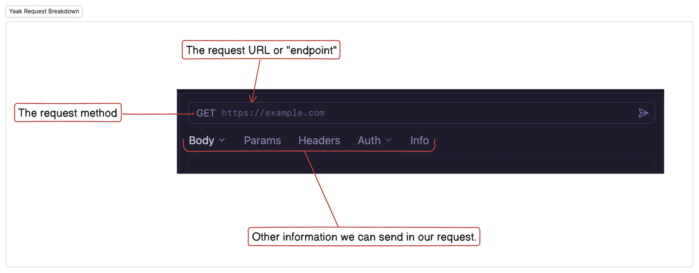
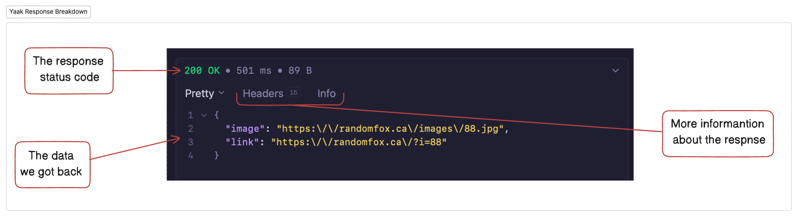

# External APIs and Testing with Yaak

## Fetching Data

Software developers have access to a bountiful world of data that companies, and other developers, make available for them to request and use in their own applications. Up to this point in the course, you've been using your own data contained in a file on your machine.

In this introduction, you are going to request data from someone else's computer somewhere else in the world via the World Wide Web (WWW). 

You will be able to access this data by making requests to an API.

## Introduction to APIs

An API (Application Programming Interface) is a set of rules and protocols that allows different software applications to communicate with each other. Think of an API as a waiter in a restaurant:

1. You (the client) make a request from the menu
2. The waiter (the API) takes your request to the kitchen
3. The kitchen (the server) prepares what you ordered
4. The waiter brings back your food (the response)

## Communication Between an API and a Client

When a client application needs to interact with an API, it follows a request-response cycle:

1. **Client Makes a Request**: Your application sends a request to a specific URL (endpoint) with details about what it wants
2. **API Processes the Request**: The server receives the request, processes it, and determines what to send back
3. **Server Prepares a Response**: The server gathers the requested data from the database or performs the requested action
4. **API Returns the Response**: The server sends back data (usually in JSON format) and a status code
5. **Client Processes the Response**: Your application receives the data and uses it as needed

### Common HTTP Methods in API Requests:

- **GET**: Retrieve data (what we'll focus on today)
- **POST**: Create new data
- **PUT/PATCH**: Update existing data
- **DELETE**: Remove data

## ⚠️ Be Prepared, Beginner!

This is one of the most significant cognitive challenges that beginner software developers face. The asynchronous nature of how the web browser handles WWW requests stretches your working memory to capacity. It will take weeks and weeks of practice before you have any chance of truly understanding the mechanism. You may not gain understanding until after your time at NSS and a year or two on the job. However, you will learn how to write the correct syntax for one and where you need to make the requests.

Come back to this chapter and review the section describing API's given above as you complete the chapters and projects in this course. If you do so, this explanation will begin to make more sense to you.

## 🦊🐶 Introducing Fun Image APIs

For our Foxy Dog project, we'll be working with two APIs that return random animal images:

1. **Random Fox API**: Provides random fox images
   - Endpoint: `https://randomfox.ca/floof/`
   - Returns a JSON object with an image URL

2. **Random Dog API**: Provides random dog images
   - Endpoint: `https://random.dog/woof.json`
   - Returns a JSON object with an image URL

## Testing APIs with Yaak

Before integrating these APIs into our application, we should test them to understand how they work and what data they return. For this, we'll use **Yaak**, a user-friendly API testing tool.

### What is Yaak? 

Yaak is an API testing tool that allows developers to send requests to APIs and view the responses in a clean, organized interface. There are many other api testing tools that offer the same functionality, but Yaak is much simpler and easier for beginners so we will use it throughout the course. 

### Installing Yaak

1. Visit [https://yaak.app/](https://yaak.app/)
2. Click on the download button for your operating system
3. Follow the installation instructions
4. Launch the application

### Making a GET Request with Yaak

Now that you have Yaak installed, let's make our first GET request to the Random Fox API:

1. Open Yaak
2. Click on the + or use the keyboard shortcut to open a new request
3. Choose **HTTP**
4. Ensure the request method is set to `GET`
5. In the request URL field, enter: `https://randomfox.ca/floof/`
6. Click the "Send" button

You should see a response that looks something like this:

### Understanding the Response

When you make a GET request to an API, there are two important elements to pay attention to for now:

#### Status Code
The status code tells you whether your request was successful:
- **200**: Success! Everything worked as expected.
- **404**: Not Found - The endpoint you're trying to reach doesn't exist.
- **500**: Server Error - Something went wrong on the server's end.

For a successful request to our animal APIs, you should see a status code of **200**.

#### Response Body
This contains the actual data returned by the API. In our case, it's a JSON object with an image URL.

## So what happened?

The client, Yaak, made a request to the random fox api over the world wide web. The random fox api, running on some computer somewhere else in the world, processed that request and returned to the client what it asked for in a response, along with some more information about the response, such as the status of that response.

Let's see what that looks like. 

## Practice Exercise: Testing the Random Dog API

Now it's your turn to test the Random Dog API:

Using Yaak, make a **GET** request to the [Random Dog Api](#introducing-fun-image-apis).

### Questions to Answer:

1. What status code did you receive?
2. What does the response JSON structure look like?
3. How is it different from the Fox API response?
4. Copy the image URL from the response and paste it into a browser. What happens?

## What We've Learned

In this chapter, we've:
- Learned what an API is and how it enables communication between applications
- Explored how clients and servers interact through APIs
- Discovered two fun animal image APIs
- Used Yaak to test API endpoints
- Made GET requests and examined the responses

### 📓 Vocabulary
> **Client:** The application that sends a request for data or services. This is like you, the customer, in a restaurant.

> **API:** (Application Programming Interface): A set of rules that allows one piece of software to talk to another. Think of it as a menu in a restaurant - it lists what you can order and how to ask for it.

> **Server:** The computer that receives requests from clients and sends back responses. This is like the kitchen in a restaurant that prepares your food.

> **Endpoint:** A specific URL where an API can be accessed. Think of it as a specific counter or window where you place your order in a restaurant.

> **Request:** The message a client sends to a server asking for something. This is like placing your order in a restaurant.

> **Response:** The data that the server sends back to the client after receiving a request. This is like the food you receive after ordering.

> **Status Code:** A number that indicates whether a request was successful or not. Think of it as the waiter telling you "Your food is ready" (200 OK) or "Sorry, we're out of that dish" (404 Not Found).

This foundational knowledge will prepare you for the next steps where we'll learn how to integrate these APIs into our application using JavaScript's fetch API and handle the responses using promises.

## Next Steps

In the upcoming chapters, we'll:
- Write client-side JavaScript to fetch data from our animal APIs
- Learn about promises and how to use `.then()` syntax
- Explore the modern `async/await` syntax for handling asynchronous operations
- Build a fun application that displays random fox and dog images

Up Next: [Next Chapter]()