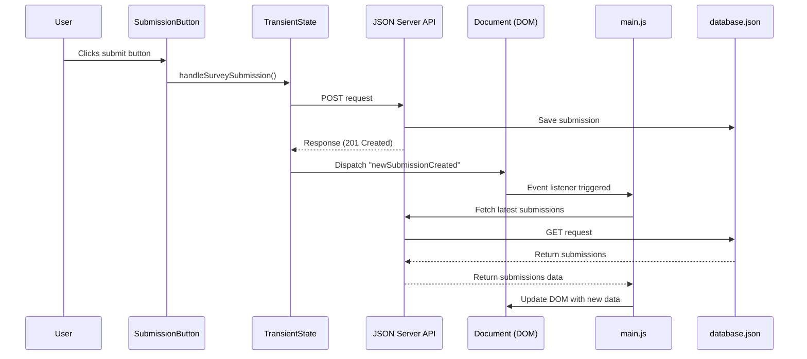

# Custom Events for State Changes

## The Re-render Problem

In our application so far, we can collect user input, save it to the database, and display existing submissions. However, there's a problem: when a user submits a new survey, the list of submissions doesn't update automatically. The user would need to refresh the page to see their new submission.

Let's think about why this happens:

1. When the page first loads, our `render()` function in `main.js` runs, fetching and displaying all submissions
2. When a user submits a form, we save the data to the database
3. But nothing tells our application to re-run the `render()` function to fetch and show the updated submissions

We need a way for different parts of our application to communicate with each other. This is where custom events come in.

## Understanding Custom Events

So far, we've worked with built-in browser events like `click` and `change`. These events are triggered by user interactions with the page. Custom events are events that we create ourselves to signal when something important happens in our application.

Custom events work similarly to built-in events:
1. You create and dispatch a custom event
2. Other parts of your code can listen for this event
3. When the event occurs, the listener functions are called

## Modifying the Transient State Module

Let's update our `saveSurveySubmission` function in `transientState.js` to dispatch a custom event ***after a submission is saved***:

```javascript
export const saveSurveySubmission = async () => {
    const postOptions = {
        method: "POST",
        headers: {
            "Content-Type": "application/json"
        },
        body: JSON.stringify(transientState)
    }

    const response = await fetch("http://localhost:8088/submissions", postOptions)

    // Dispatch a custom event when the submission is complete
    const newSubmissionEvent = new CustomEvent("newSubmissionCreated")
    document.dispatchEvent(newSubmissionEvent)
}
```

Let's break down what we've added:

1. After the POST request completes, we create a new `CustomEvent` and defined the type "newSubmissionCreated"
2. We then dispatch this event on the document object, making it available to any listeners in our application

The `CustomEvent` constructor takes a string argument which is the name of the event. This name can be anything we choose, but it should be descriptive of what happened.

## Listening for Custom Events in main.js

Now that we're dispatching an event when a submission is created, we need to listen for this event and respond by re-rendering the page. Let's update our `main.js` file:

```javascript
import { JeanChoices } from "./JeanChoices.js"
import { LocationChoices } from "./LocationChoices.js"
import { SubmissionButton } from "./SubmissionButton.js"
import { SubmissionList } from "./SubmissionList.js"

const container = document.querySelector("#container")

const render = async () => {
    const jeansHTML = JeanChoices()
    const locationsHTML = await LocationChoices()
    const buttonHTML = SubmissionButton()
    const submissionsHTML = await SubmissionList()

    container.innerHTML = `
        ${jeansHTML}
        ${locationsHTML}
        ${buttonHTML}
        ${submissionsHTML}
    `
}

// Add an event listener for our custom event
document.addEventListener("newSubmissionCreated", render)

render()
```

We've added an event listener that:
1. Listens for the "newSubmissionCreated" event on the document
2. Calls our `render()` function when this event occurs

Now when a new submission is created, the page will automatically re-render to include the new submission.

## The Event-Driven Flow

Let's visualize the full event-driven flow in our application:



This sequence shows how:
1. User interaction triggers a submission
2. The submission is saved to the database
3. A custom event is dispatched
4. The event triggers a re-render
5. The latest data is fetched and displayed

## Benefits of Custom Events

Custom events provide several advantages:

1. **Loose Coupling**: Components can communicate without direct dependencies on each other
2. **Scalability**: As your application grows, events allow for more modular code
3. **Readability**: Events make the flow of your application easier to understand
4. **Reusability**: Multiple components can listen for the same event

## Testing the Custom Event

To test our custom event:

1. Make sure both your JSON server and web server are running
2. Open your application in the browser
3. Fill out the survey form and click the "Save Submission" button
4. Watch as the list of submissions updates automatically with your new entry

## 📓 Key Concepts to Remember

1. **Custom Events**: User-defined events that signal when something important happens in your application.

2. **Event Dispatch**: Use `document.dispatchEvent(new CustomEvent("eventName"))` to trigger an event.

3. **Event Listeners**: Use `document.addEventListener("eventName", handlerFunction)` to listen for events.

4. **Event-Driven Architecture**: Different parts of your application communicate through events rather than direct function calls.

5. **Re-rendering**: Updating the DOM to reflect changes in your application's state.

## 🎓 Practice Exercise: Survey Clearing

Dr. Jones has requested a new feature: after submitting a survey, the radio buttons should be cleared (unselected) to make it easier to submit another survey.

Your task:
1. Modify your application to clear the form selections after a successful submission
2. Think about where this code should go - should it be part of the event handler? A separate function?
3. Consider how you might need to add another custom event or modify existing ones

Hint: You can set a radio button's `checked` property to `false` to unselect it, but you'll need to select all radio buttons first.

## 📝 What We've Learned

In this chapter, we've:
- Identified the need for automatic re-rendering when data changes
- Created a custom event to signal when a new submission is saved
- Added an event listener to re-render the page when this event occurs
- Explored the benefits of event-driven architecture
- Visualized the flow of events in our application

## 🔜 Next Steps

With our Indiana Jeans survey application now complete, we've covered important concepts in client-side web development: working with APIs, capturing user input, managing state, and implementing event-driven updates. These concepts will serve as a foundation as we move on to more complex applications.

In the next project, we'll explore more advanced techniques for filtering data, working with more complex relationships, and creating more interactive user interfaces.