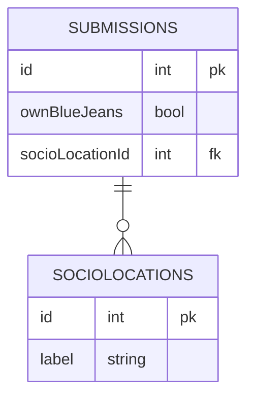

# Your Own API

In the last project, you reached out over the Web to other people's servers to get a random image of a fox and a cat. In this project, your own laptop will be the server **and** the client. You will use the `json-server` command line application to host your own API.

## Recommended Installs

### JSON Formatter Extension

Visit the [JSON Formatter](https://chrome.google.com/webstore/detail/json-formatter/bcjindcccaagfpapjjmafapmmgkkhgoa) page in the Chrome Web Store and install it. This will make data more readable in the browser.

### Postman

Visit the [Postman downloads](https://www.postman.com/downloads/) page to download and install the application for your operating system (OS). Postman is a very popular tool that allows developers to easily interact with a REST API without having to write code.

## Submissions Database

The database needed for this application is pretty simple. Two resources are needed.

1. **Submissions**
1. **SocioLocations**

The properties on the **Submissions** resource are as follows.

* id (integer)
* ownsBlueJeans (boolean)
* socioLocationId (integer foreign key)

The properties on the **SocioLocations** resource are as follows.

* id (integer)
* label (string)

> JSON Server has a couple rules on how your arrays and foreign keys should be named.
>
> 1. Collections should be plural and lower case _(e.g. balloons, products, customers)_
> 2. Foreign keys to those collections should be singular and always end in `Id` _(e.g. balloonId, productId, customerId)_



You are going to store this data in the `api/database.json` file. This is your first exposure managing your own JSON data, so here is what you need to put in your `database.json` file. You are going to start off with a single submission already made so that you can see what the data should look like.

```json
{
    "submissions": [
        {
            "id": 1,
            "ownsBlueJeans": false,
            "socioLocationId": 1
        }
    ],
    "socioLocations": [
        {
            "id": 1,
            "label": "Urban"
        },
        {
            "id": 2,
            "label": "Suburban"
        },
        {
            "id": 3,
            "label": "Semi-Rural"
        },
        {
            "id": 4,
            "label": "Rural"
        }
    ]
}
```

## Running JSON Server

1. Open a new terminal, so that you can two separate ones running simultaneously.
2. In one of the terminals, make sure you are in the `api` directory for the Indiana Jeans project.
3. Run the following command: `json-server database.json -p 8088`

You should see the following output.

```sh
  \{^_^}/ hi!

  Loading database.json
  Done

  Resources
  http://localhost:8088/submissions
  http://localhost:8088/socioLocations

  Home
  http://localhost:8088

  Type s + enter at any time to create a snapshot of the database
```

## Using Postman

Open the **Postman** application and create a new request to see the submission currently in the database.

1. Press **Cmd+N** on Mac, or **Ctrl+N** in Windows.
2. Choose **HTTP Request**.
3. Enter `http://localhost:8088/submissions` in the URL field.
4. Press **Enter** or click the **Send** button.
5. Verify that the submission JSON appears at the bottom.


**Congratulations**, you now have your very own API running on your machine.
