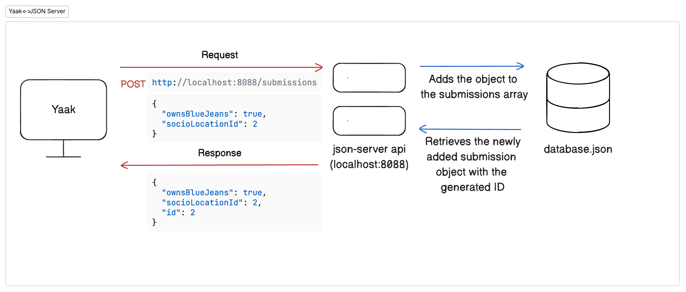

# Database Design and API

## Entity Relationship Diagram (ERD)

In the previous chapter, we learned about Dr. Henrietta Jones and her research project on blue jeans. Now, we need to create a database to store the survey data.

Let's look at the ERD for our Indiana Jeans survey:


This diagram shows:
- Two tables: `submissions` and `socioLocations`
- A one-to-many relationship: Many submissions can reference one socioLocation
- The Foreign Key `socioLocationId` in the submissions table connects to the Primary Key `id` in the socioLocations table

## Introduction to JSON Database

For our client-side applications, we will be using a JSON file to simulate a structured database, similar to what you'd find in a real-world application. While it won't have the full capabilities of a relational database like PostgreSQL or MySQL (we'll set up one of these in the server-side portion of this course), it will allow us to work with data in a way that mimics how a backend stores and retrieves information.

> JSON (JavaScript Object Notation) is a lightweight data format that's easy for humans to read and write, and easy for machines to parse and generate.

Our ERD acts as a blueprint for this database. It has defined each table (or in the case for our JSON file, each array) and each row in the tables (properties for each object in the tables)

In this project, we'll use a JSON file to store:
1. Survey submissions (who owns blue jeans and where they live)
2. Predefined socioeconomic locations (Urban, Suburban, etc.)

## Setting Up the JSON Database

In `database.json` in your project's `api` directory and add the following JSON content:

```json
{
  "submissions": [
    {
      "id": 1,
      "ownsBlueJeans": false,
      "socioLocationId": 1
    }
  ],
  "socioLocations": [
    {
      "id": 1,
      "label": "Urban"
    },
    {
      "id": 2,
      "label": "Suburban"
    },
    {
      "id": 3,
      "label": "Semi-Rural"
    },
    {
      "id": 4,
      "label": "Rural"
    }
  ]
}
```

This JSON file contains:
- An array of `submissions` with one sample submission
- An array of `socioLocations` with four options for survey respondents

## Introducing JSON Server API

Now that we have our database file, we need a way to interact with it. For this, we'll use **JSON Server**, a simple tool that allows us to interact with our JSON file with an API.

### What is JSON Server?

JSON Server is a Node.js package that allows you to create a fake API with zero coding. It uses a JSON file as the database and automatically generates [endpoints](./FD_INTRO_TO_API.md#-key-concepts-to-remember) to access and modify that data.

### Installing JSON Server

You should already have json-server installed. Check this by running the following command in your terminal:

```sh
json-server --version
```

You should see `0.17.3` as the output. 

If you get a different version output or an error, run the following commands in your terminal:

```sh
npm uninstall -g json-server
npm install -g json-server@0.17.4
```

Run the `json-server --version` command in your terminal once more. If you *still* do not see `0.17.3`, ask an instructor for help.

### Starting JSON Server

Open a new tab in your terminal. (`cmd + t` or `ctrl + t`) Navigate to the `api` directory in your project and run:

```sh
json-server -p 8088 -w database.json
```

This command:
- Starts JSON Server on port 8088
- Watches (-w) the database.json file for changes
- Creates endpoints based on the top-level keys in your JSON file

You should see output similar to:

```
\{^_^}/ hi!

  Loading database.json
  Done
```

JSON server will also list the available endpoints it made based on your JSON file.

```sh
Resources
  http://localhost:8088/submissions
  http://localhost:8088/socioLocations
```

## Testing the API with Yaak

Now let's use Yaak to test our API and see how it works.

### Making a GET Request

First, let's retrieve all the socioLocations from our database:

1. Open Yaak
2. Create a new HTTP request 
3. Set the method to `GET`
4. Enter the endpoint for `socioLocations` (take a look at the terminal output from json-server if you're unsure what the endpoint is)
5. Hit enter or click ➤ (send)

***Well looky here!***

You should have received a response with a status code of `200 OK` and a JSON array containing all four socioLocations. This data should look pretty familiar! It's the socioLocation data we added to the `database.json` file. 🎉 Yaak made an HTTP GET request to the JSON server api we spun up on localhost:8088. The JSON-server api retrieved the socioLocations from our JSON "database". The JSON-server api then returned the socioLocations back to Yaak in the HTTP response. Let's see that in color:


### Understanding the POST Method

While the GET method *retrieves* data, the POST method allows us to *create* new data. Here's how it works:

1. The client sends a POST request with new data in the **request body**
2. The api processes the request and adds the data to the database
3. The api responds with the newly created data, including an auto-generated ID

### Making a POST Request

Let's create a new survey submission:

1. In Yaak, create a new HTTP request
2. Set the method to `POST`
3. Enter the endpoint for `submissions` (take a look at the terminal output from json-server if you're unsure what the endpoint is)
4. Click the **Body** dropdown and select `JSON`. This is the type of data we are sending in our request.
5. In the request body, add:
   ```json
   {
     "ownsBlueJeans": true,
     "socioLocationId": 2
   }
   ```
   This is the submission we want to add to the database.
6. Hit enter or click ➤

You should receive a response with:
- Status code 201 (Created)
- A JSON object of your new submission, now with an auto-generated ID

To verify the submission was saved, make a GET request to the `submissions` endpoint. You should see both the original submission and your new one.

Let's break down what happened again: Yaak made an HTTP POST request to the JSON server api we spun up on localhost:8088, sending along the data for a new submission in the request body. The JSON-server api received this data and added it to our JSON 'database' in the submissions array. The JSON-server api then returned the newly created submission (now with an ID) back to Yaak in the HTTP response. Let's see that in color:



## 📓 Key Concepts to Remember

1. **JSON Database**: A simple file-based way to store structured data for client-side applications, organized as arrays of objects.

2. **JSON Server**: A Node.js tool that creates an API from a JSON file without requiring backend code.

3. **API Endpoints**: URLs that your application can interact with to perform CRUD (Create, Read, Update, Delete) operations on your data.

4. **HTTP Methods**:
   - **GET**: Retrieves data from the server
   - **POST**: Creates new data on the server

5. **Status Codes**:
   - **200 OK**: Successful GET request
   - **201 Created**: Successful POST request

6. **Request Body**: Data sent to the server in a POST request, typically in JSON format.

7. **Relational Data**: Connecting data between tables using foreign keys (like linking submissions to socioLocations).

## 🎓 Practice Exercise

1. Use Yaak to make another POST request to add a new submission with:
   - `ownsBlueJeans`: false
   - `socioLocationId`: 3
2. Verify it was added by making a GET request to `/submissions`
3. 🧭 **Explorer Exercise**: Try making a GET request to `/submissions/2` to retrieve just the second submission
4. 🏕 **Pioneer Exercise**: Try making a GET request to `/submissions?_expand=socioLocation` - What's different about the response?

## 📝 What We've Learned

In this chapter, we've:
- Created a JSON database file
- Started a JSON Server to create an API
- Learned about the POST HTTP method
- Used Yaak to test our API endpoints


## 🔜 Next Steps

In the upcoming chapters, we'll build the client-side interface for our survey, allowing users to select from radio buttons and submit their responses to our API.

Up Next: [Do You Own Jeans?](./IJ_JEANS_COMPONENT.md)