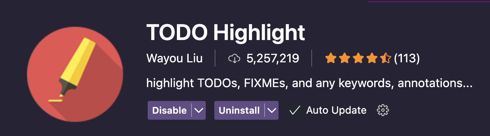
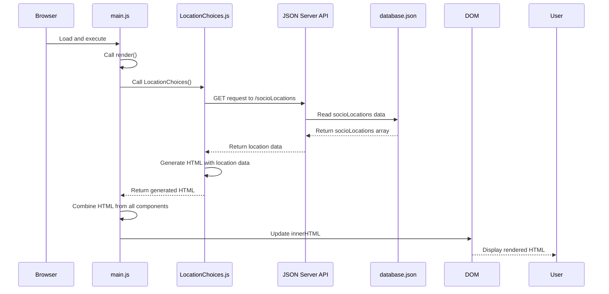
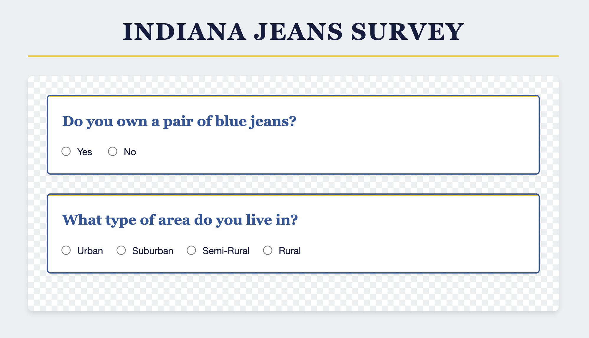

# Building the Location Choices Component

In the previous chapter, we created our first component with static radio buttons for the jeans ownership question. Now, we'll take our application to the next level by creating a component that dynamically builds radio buttons based on data from our API.

This is a key concept in modern web development: instead of hardcoding options in our HTML, we'll fetch the available choices from our database and generate the HTML programmatically. This approach makes our application more flexible and easier to maintain.

> ⚠️ **REMEMBER:** Simply copying and pasting the provided code snippets is not recommended as it does not produce understanding or retention. We encourage you to type out the code, or at the very least read the code line by line. This way you think about what the code snippet actually does as you add it to your project. If at any point the code doesn't make sense to you, revisit the Fox y Cat chapters to brush up on promises and async/await.

## Creating the LocationChoices Component

Let's create a new component for asking users about the type of area they live in:

1. Create a new file called `LocationChoices.js` in your `scripts` directory
2. Let's add the basic structure for our component:

```javascript
export const LocationChoices = () => {
   // TODO: Fetch locations from the API
    
    let html = `
        <div class="survey-input">
            <h2>What type of area do you live in?</h2>
    `
    
    // TODO: generate radio buttons and add to html

    html += `
        </div>
    `
    
    return html
}
``` 

> 💡 **FUN TIP:** 
> |  | ***TODO Highlight*** is a fun vscode extension that automatically highlights the text `TODO:` in your editor. |
> |-|-|

## Fetching Data from the JSON Server API

Now, let's add the code to fetch the location choices from our API:

```javascript
export const LocationChoices = async () => {
    const response = await fetch("http://localhost:8088/socioLocations")
    const locations = await response.json()

    let html = `
        <div class="survey-input">
            <h2>What type of area do you live in?</h2>
    `
    
    // TODO: generate radio buttons and add to html

    html += `
        </div>
    `

    return html
}
```

In this code, we:
1. Make a GET request to our JSON Server API endpoint for socioLocations
2. Wait for the response (`fetch()` is asynchronous)
3. Convert the response to a JavaScript object using `.json()` and wait for the converted data (`.json()` is asynchronous)
4. Store the locations in a variable that we'll use to generate our radio buttons

Notice that we've marked our function as `async`. This is because we had to await our `fetch()` and `.json()` operations.

## Updating the Main Module

Though we have not generated our radio buttons yet, let's go ahead and update our `main.js` file to include our new component, this way we can invoke the function and view the request in the network tab to confirm everything is working properly. It's very important to continually test your code as you implement it. 

See if you can do this on your own. Expand the hints below if you need some help.

<details>
    <summary>💡 Algorithm</summary>

1. Import the new `LocationChoices` component
2. Invoke `LocationChoices` in the render function using the `await` keyword since this function is defined as `async` and therefore returns a promise.
3. Store the returned html in a variable
5. Make the `render` function `async` since it invokes an async function
6. Add the `locationsHTML` to the container
</details>

<details>
    <summary>💡 Code</summary>

```javascript
import { JeanChoices } from "./JeanChoices.js"
import { LocationChoices } from "./LocationChoices.js"

const container = document.querySelector("#container")

const render = async () => {
    const jeansHTML = JeanChoices()
    const locationsHTML = await LocationChoices()
    
    container.innerHTML = `
        ${jeansHTML}
        ${locationsHTML}
    `
}

render()
```
</details>

## Examining Network Requests with the Network Tab

Let's examine what happens behind the scenes when we make this fetch request. 

To view your request:
1. Open the developer tools 
2. Click on the "Network" tab
3. Choose `Fetch/XHR` to reduce some of the noise
4. Refresh the page to see the requests

When the `LocationChoices` component runs, you'll see a request to `socioLocations` in the Network tab. Clicking on this request reveals:

- **Headers**: Contains information about the request, including:
  - URL: http://localhost:8088/socioLocations
  - Method: GET
  - Status Code: 200 OK (indicating success)

- **Preview/Response**: Shows the actual data returned from the server, which should be an array of location objects like:
  ```json
  [
    {
      "id": 1,
      "label": "Urban"
    },
    {
      "id": 2,
      "label": "Suburban"
    },
    ...
  ]
  ```

This visual inspection helps you understand:
- If your request was successful
- What data you received
- How it's structured (now we know which properties to access to generate our radio buttons)

## Generating Radio Buttons Dynamically

Now that we have our locations data and we understand the structure of the data, let's generate a radio button for each location option:

```javascript
export const LocationChoices = async () => {
    const response = await fetch("http://localhost:8088/socioLocations")
    const locations = await response.json()
    
    let html = `
        <div class="survey-input" id="location-choice">
            <h2>What type of area do you live in?</h2>
    `

    for (const location of locations) {
        html += `<input type="radio" name="location" value="${location.id}" /> ${location.label}`
    }
    
    html += `
        </div>
    `
    
    return html
}
```

In this code, we:
1. Use a `for...of` loop to iterate through each location in our array
2. For each location, we generate an HTML string for a radio button:
   - The `name` attribute is set to "location" for all buttons (making them work as a group)
   - The `value` attribute is set to the location's ID (which we'll use later to store the user's choice)
   - After the radio button, we display the location's label

## The System at Work

Let's visualize what's happening in our application with a sequence diagram:



1. The browser loads `main.js`, which calls `render()`
2. `render()` calls `LocationChoices()`
3. `LocationChoices()` makes a GET request to the JSON Server API
4. The JSON Server API reads data from database.json
5. `database.json` returns the `socioLocations` array
6. The API returns the location data to `LocationChoices()`
7. `LocationChoices()` generates HTML with the data and returns it
8. `render()` combines the HTML from all components and updates the DOM
9. The user sees the rendered HTML in the browser

## The Rendered Component

You should now see:
- The "Do you own a pair of blue jeans?" question with Yes/No options
- A new question "What type of area do you live in?" with four radio button options: Urban, Suburban, Semi-Rural, and Rural



## 📓 Key Concepts to Remember

1. **Async/Await**: When functions make API calls, they should be marked as `async` and use `await` for asynchronous operations
2. **Fetch API**: Used to make HTTP requests to your backend API
3. **Dynamic HTML Generation**: Using JavaScript to create HTML based on data from an API
4. **Network Tab**: A developer tool that allows you to inspect HTTP requests and responses
5. **Radio Button Groups**: Radio buttons with the same `name` attribute work as a group where only one can be selected

## 🎓 Practice Exercise: Dr. Jones' Research Expansion

Dr. Jones has rushed into your office with exciting news! Her research grant has been expanded to include metropolitan areas, and she needs you to update the survey right away.

"I need to add 'Metropolitan' as a new location category before my presentation tomorrow," she explains, adjusting her iconic hat. "The urban/rural spectrum is incomplete without it!"

Where should you make this change?

## 📝 What We've Learned

In this chapter, we've:
- Created a new component that fetches data from our API
- Used the `async/await` syntax for handling asynchronous API calls
- Generated HTML dynamically based on data from the database
- Used the browser's Network tab to inspect HTTP requests and responses
- Updated our main render function to include multiple components

## 🔜 Next Steps

Our radio buttons now appear correctly but they don't actually capture the user's choices yet. In the next chapter, we'll learn about "transient state" - a way to temporarily store user selections before saving them to the database. We'll add event listeners to our radio buttons to capture the user's choices and store them in this transient state.
