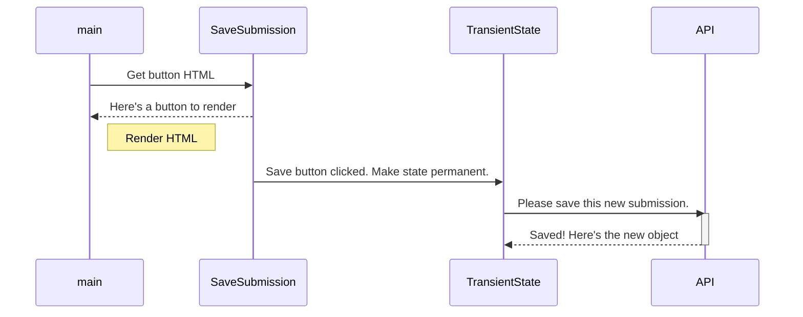

# Submissions

In this chapter, you are going to implement two significant additions to your project.

1. Write a function in your **TransientState** module that will perform a `fetch()` to send the transient state to your local API.
2. Implement a **Save Submission** button in your UI, and then write a click event listener that will invoke the new function.

## Your First POST Request

This video will walk you through the code and concepts for a new type of `fetch()` with a method of **POST** which is a request to create something new in the API instead of getting something from it.

Implement the code once you are done watching the video.

## Save Submission Component

This video shows you how to add a button to your UI, listen for a click event, and then trigger the **POST** request to save user choices to permanent state.

Implement the code once you are done watching the video.

## Sequence Diagram

