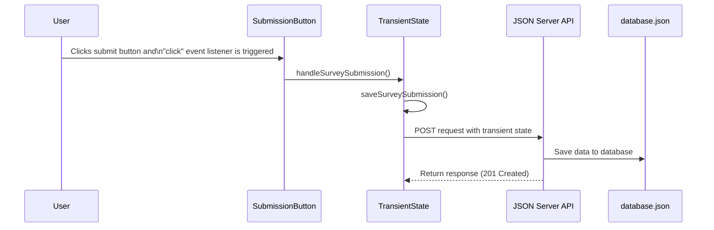

# Saving Survey Submissions

## Introduction to Permanent State

In the previous chapter, we created our transient state module and updated our components to capture user choices. Now, we're ready to take the final step: saving the user's selections to our database, transforming transient state into permanent state.

To accomplish this, we'll need to:

1. Create a submission button component
2. Add functionality to post our transient state object to the database (permanent state)
3. Create an event listener to trigger the submission process

## Creating the Submission Button Component

Let's start by creating a simple button that users can click to submit their survey responses.

Create a new file called `SubmissionButton.js` in your `scripts` directory:

```javascript
const handleSurveySubmission = (clickEvent) => {
    if (clickEvent.target.id === "submission-button") {
        console.log("Button clicked!")
    }
}

export const SubmissionButton = () => {
    document.addEventListener("click", handleSurveySubmission)

    return `<button id='submission-button'>Save Submission</button>`
}
```

Let's break down what this component does:

1. We define a `handleSurveySubmission` function that:
   - Checks if the clicked element has the ID "submission-button"
   - If so, logs a message to the console
   
2. We create and export the `SubmissionButton` component that:
   - Adds an event listener for click events and invokes `handleSurveySubmission` when a click happens
   - Returns HTML for a button with the ID "submission-button"

## Adding the Button to Main.js

Now, let's update our `main.js` file to include the submission button:

```javascript
import { JeanChoices } from "./JeanChoices.js"
import { LocationChoices } from "./LocationChoices.js"
import { SubmissionButton } from "./SubmissionButton.js"

const container = document.querySelector("#container")

const render = async () => {
    const jeansHTML = JeanChoices()
    const locationsHTML = await LocationChoices()
    const buttonHTML = SubmissionButton()
    
    container.innerHTML = `
        ${jeansHTML}
        ${locationsHTML}
        ${buttonHTML}
    `
}

render()
```

We've added:
1. An import for the `SubmissionButton` component
2. A call to the `SubmissionButton()` function to get the button HTML
3. The button HTML in our container's content

This gives us a simple way to verify that our button is working before we add more complex functionality. **Time to test.** Refresh the browser and click the button. Do you see the console log?

## Updating the Transient State Module

Now we need to add functionality to our transient state module to convert our temporary data into permanent data in the database. 

### Building the POST Request

So far in this course, you've used `fetch()` to make GET requests to retrieve data from an API. Now we need to use `fetch()` to make a POST request to create data.

Think about what we'll need:
1. What HTTP method will we use instead of GET?
2. What data will we need to send to the server?
3. How will we format that data?

Let's add a new function to our `transientState.js` file that will handle this conversion:

```javascript
// Function to convert transient state to permanent state
export const saveSurveySubmission = async () => {
    // Start building the POST request here
    console.log("Saving survey to database...")
    console.log(transientState)
}
```

**Time to test.** Update your `SubmissionButton.js` file to import and call this function on the button click. If you test your button now, you should see your transient state object logged to the console. This confirms that we have access to the data we want to save.

### Creating the POST Request Options

When making a POST request, we need to provide more configuration than we did with GET requests. Specifically, we need to:
1. Specify the HTTP method as "POST"
2. Set headers to tell the server we're sending JSON data
3. Include a body with the data we want to create

Update your `saveSurveySubmission` function:

```javascript
export const saveSurveySubmission = async () => {
    // Create the options for fetch()
    const postOptions = {
        method: "POST",
        headers: {
            "Content-Type": "application/json"
        },
        body: JSON.stringify(transientState)
    }
    
    // TODO: Add fetch() call here
}
```

Let's analyze what we've added:

1. We create a `postOptions` object with:
   - `method: "POST"` to specify we're creating data
   - `headers` object with `"Content-Type": "application/json"` to tell the server we're sending JSON
   - `body` containing our transient state converted to a JSON string using `JSON.stringify()`

The `JSON.stringify()` function is critical - it converts our JavaScript object to a JSON string that the server can understand.

### Making the POST Request

Now let's complete our function by making the actual fetch request:

```javascript
export const saveSurveySubmission = async () => {
    const postOptions = {
        method: "POST",
        headers: {
            "Content-Type": "application/json"
        },
        body: JSON.stringify(transientState)
    }

    // Send the data to the API
    const response = await fetch("http://localhost:8088/submissions", postOptions)
}
```
This fetch call takes two arguments:
  - The URL for our submissions endpoint
  - The postOptions object which defines the method of our request (POST), the type of data we're sending (application/json), and the data itself (our submission object converted to a JSON string).


### The Complete Transient State Module

Your complete `transientState.js` file should now look like this:

```javascript
// Set up the transient state data structure and provide initial values
const transientState = {
    ownsBlueJeans: false,
    socioLocationId: 0
}

// Functions to modify each property of transient state
export const setOwnsBlueJeans = (chosenOwnership) => {
    transientState.ownsBlueJeans = chosenOwnership
}

export const setSocioLocationId = (chosenLocation) => {
    transientState.socioLocationId = chosenLocation
}

// Function to convert transient state to permanent state
export const saveSurveySubmission = async () => {
    const postOptions = {
        method: "POST",
        headers: {
            "Content-Type": "application/json"
        },
        body: JSON.stringify(transientState)
    }

    const response = await fetch("http://localhost:8088/submissions", postOptions)
}
```

## Testing the Submission Process

**Time to test** your submission process. Refresh the browser, open the devtools to the Network tab, and make a submission. Look for the POST request to "submissions".

Clicking on this request reveals detailed information:

- **Headers tab**: Shows request URL, method (POST), status code (201 Created)
- **Payload tab**: Shows the data that was sent (your transient state)
- **Preview/Response tab**: Shows the server's response, including the new ID

You can also verify the submission was saved by:
1. Making a GET request to `http://localhost:8088/submissions` in Yaak
2. Looking at your database.json file, which should now include the new submission

## Examining Network Requests

Let's take a closer look at what's happening in the Network tab when you submit the form:

### Request Headers
- **URL**: `http://localhost:8088/submissions`
- **Method**: POST
- **Status Code**: 201 Created
- **Content-Type**: application/json

### Request Payload
This is the data you sent to the server:
```json
{
  "ownsBlueJeans": true,
  "socioLocationId": 2
}
```

### Response
This is what the server sent back:
```json
{
  "ownsBlueJeans": true,
  "socioLocationId": 2,
  "id": 2
}
```

Notice that the server added an `id` property to your data. This unique identifier allows you to reference this specific submission later.

## Visualizing the Submission Process

Let's visualize the entire process from the user clicking the button to the data being saved in the database:



This sequence diagram shows how:
1. The user clicks the submission button
2. The click event triggers `handleSurveySubmission()`
3. This function calls `saveSurveySubmission()`
4. `saveSurveySubmission()` makes a POST request to the JSON Server API
5. The API saves the data to our database.json file
6. The API returns a response with status 201


## 📓 Key Concepts to Remember

1. **Converting Transient to Permanent State**: When we save form data to a database, we're converting transient state (temporary, in-memory data) to permanent state (persisted data).

2. **POST Request Configuration**: A POST request requires:
   - The correct URL endpoint
   - The HTTP method set to "POST"
   - A Content-Type header (usually "application/json")
   - A body containing the data to be created

3. **JSON.stringify()**: Converts JavaScript objects to JSON strings for sending to the server.

4. **Status Code 201**: Indicates that a resource was successfully created.

## 🎓 Practice Exercise: Complete or Incomplete?

Dr. Jones has asked for a new feature: she'd like to make sure a survey submission is complete (has both jeans ownership and location data) before submission. Too many incomplete survey responses have come through.

Your task:
1. Update the `saveSurveySubmission` function to check if both required fields have valid values:
   - `ownsBlueJeans` should be true or false (but not undefined or null)
   - `socioLocationId` should be a number greater than 0
2. If either check fails, alert the user that they need to complete the form
3. Only proceed with the POST request if both checks pass

Hint: You can use a simple if statement with an alert() for this exercise.

## 📝 What We've Learned

In this chapter, we've:
- Created a submission button component
- Added an event handler to capture button clicks
- Implemented the function to convert transient state to permanent state
- Made a POST request with `fetch()` to save data to our JSON Server API
- Used the Network tab to inspect HTTP POST requests and responses

## 🔜 Next Steps

Now that we can save submissions to our database, the next step is to display the list of existing submissions on the page. We'll create a new component that fetches all submissions and displays them in a formatted list.

Up Next: [Displaying Submissions with .map()](./IJ_SUBMISSIONS_COMPONENT.md)