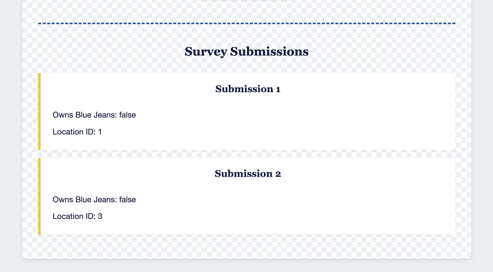
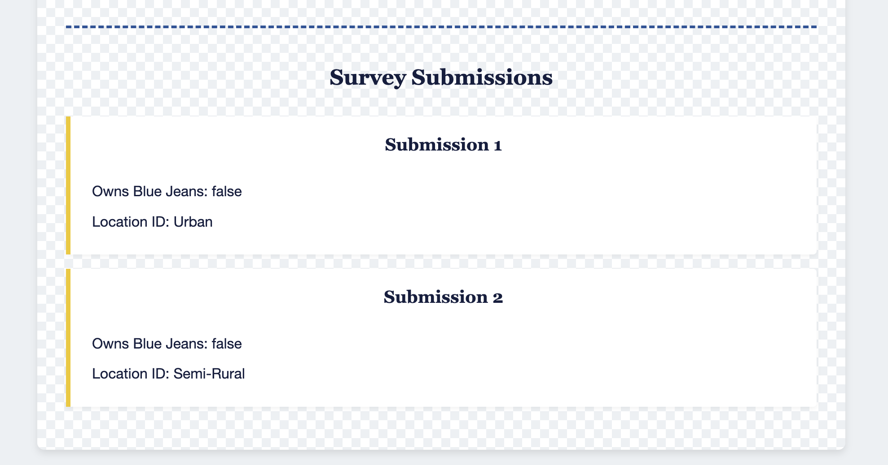

# Displaying Submissions with .map()

In the previous chapter, we implemented the ability to save survey submissions to our database. Now, we need to display those submissions on the page. This will require us to:

1. Fetch the existing submissions from the database
2. Generate HTML for each submission
3. Add the generated HTML to our page

For this task, we'll leverage the `.map()` array method, which is an essential tool for working with collections of data in JavaScript.

## Creating the SubmissionList Component

Let's start by creating a new component that will be responsible for fetching and generating html for our submissions.

Create a new file called `SubmissionList.js` in your `scripts` directory and start writing the `SubmissionList` component function. The html returned from this function will be a `div` with an id of `survey-submission-list`. The div will contain an `h2` that says "Survey Submissions" and a list of all the submissions. Don't worry about generating the html for all the submissions yet, we'll use `.map` for this. Don't forget to fetch the submissions from the api!

<details>
  <summary>💡 Expand the code below if you need help:</summary>

  ```javascript
  export const SubmissionList = async () => {
      // Fetch the submissions from your API
      const response = await fetch("http://localhost:8088/submissions")
      const submissions = await response.json()

      let html = `
          <div id='survey-submissions-list'>
              <h2>Survey Submissions</h2>
      `
      
      // TODO: Generate HTML for each submission
      
      html += `
          </div>
      `
      
      return html
  }
  ```
</details>

## Introduction to the .map() Method

Now that we have our submissions data, we need to generate HTML for each submission. This is where the `.map()` method becomes incredibly useful.

The `.map()` method creates a new array by transforming each element of the original array. For each item in the array, you provide instructions on how to convert it into something new. In our case, we want to transform each submission object into an HTML string.

Here's how the `.map()` method works:

```javascript
const newArray = originalArray.map((item) => {
    return transformedItem;
});
```

Some key points about `.map()`:
1. It creates a new array without modifying the original
2. The function is called for each element in the array
3. The function's return value is added to the new array
4. The new array will have the same length as the original

## Generating HTML with .map()

Let's update our `SubmissionList` component to use `.map()` to generate HTML for each submission:

```javascript
export const SubmissionList = async () => {
    // Fetch the submissions from your API
    const response = await fetch("http://localhost:8088/submissions")
    const submissions = await response.json()

    let html = `
        <div id='survey-submissions-list'>
            <h2>Survey Submissions</h2>
    `
    
    // Generate HTML for each submission using .map()
    const submissionsHTML = submissions.map(
        (submission) => {
            return `
                <section class="survey-submission-container">
                    <h2>Submission ${submission.id}</h2>
                    <p>Owns Blue Jeans: ${submission.ownsBlueJeans}</p>
                    <p>Location ID: ${submission.socioLocationId}</p>
                </section>
            `
        }
    )

    // Join the array of strings into a single string and add to our HTML
    html += submissionsHTML.join("")
    
    html += `
        </div>
    `
    
    return html
}
```

What we've added:
1. We call `.map()` on our submissions array
2. For each submission, we return an HTML string with the submission details
3. We use `.join("")` to combine all the HTML strings into a single string
4. We add this combined string to our main HTML

The `.join("")` method is necessary because `.map()` returns an array, but we need a single string to add to our HTML. The **empty** string parameter means we want to *join* the array elements without any character separator, such as a `,`.

### Add the SubmissionList to main.js

Update your `main.js` to include the submission list. This component will look great rendered underneath the submit button.

<details>
  <summary>💡 Completed Code</summary>

  ```javascript
  import { JeanChoices } from "./JeanChoices.js"
  import { LocationChoices } from "./LocationChoices.js"
  import { SubmissionButton } from "./SubmissionButton.js"
  import { SubmissionList } from "./SubmissionList.js"

  const container = document.querySelector("#container")

  const render = async () => {
      const jeansHTML = JeanChoices()
      const locationsHTML = await LocationChoices()
      const buttonHTML = SubmissionButton()
      const submissionsHTML = await SubmissionList()

      container.innerHTML = `
          ${jeansHTML}
          ${locationsHTML}
          ${buttonHTML}
          ${submissionsHTML}
      `
  }

  render()
  ```
</details>

## Time to Test!
You should immediately see the the results when you refresh the page, however, get some more practice observing the network tab. Remember to check the **Request URL**, **Request Method**, **Status Code**, and **Preview/Response**. 



## Exploring Related Data

Looking at our current output, you'll notice we're displaying the `socioLocationId` rather than the actual location name. This is not a great user experience. This is because our submissions table only stores the ID reference to the socioLocations table.

Let's review our ERD:


The `socioLocationId` in the submissions table is a foreign key that references the `id` in the socioLocations table. This allows us to establish a relationship between the two tables.

### Using the _expand Query Parameter

JSON Server provides a convenient way to include related data in our responses using the `_expand` query parameter. This allows us to retrieve the submission along with its related socioLocation in a single request.

Let's update our submissions fetch call to use this feature:

```javascript
export const SubmissionList = async () => {
    // Fetch the submissions with expanded socioLocation data
    const response = await fetch("http://localhost:8088/submissions?_expand=socioLocation")
    const submissions = await response.json()
    
    ...
}
```

The key changes we made:
1. Updated the fetch URL to include `?_expand=socioLocation`
2. Changed how we access the location data to use `submission.socioLocation.label` instead of `submission.socioLocationId`

Now, instead of showing just the location ID, we'll display the human-readable location label (e.g., "Urban" instead of "1").

> 💡 **RULES FOR JSON SERVER EXPAND**:
> 
> JSON server only works if you follow the proper naming conventions in your `database.json` and in your queries. For using expand, the tables (arrays) in your database *must* be lowercase plurals (submissions, socioLocations). The foreign keys *must* be the singular version of the table they point to followed by "Id" (socioLocationId). To use expand, add a query (?) to the url followed by `_expand`. Set this equal to the ***singular*** form of the foreign key data (without the trailing "Id") you wish to be included in the response (?_expand=socioLocation).

## Refactoring Submissions to Display the Location Name

After making this change to the submissions fetch call, check the network tab to view the structure of the response data. Refactor the `SubmissionList` component to display the Location name rather than the Location ID. 



## 📓 Key Concepts to Remember

1. **The .map() Method**: Transforms each element in an array and returns a new array of the same length.

2. **Array to String Conversion**: Use `.join("")` to convert an array of strings into a single string.

4. **JSON Server _expand**: The `_expand` query parameter allows you to include related data in your API responses.

## 🎓 Practice Exercises

1. Read [the MDN Docs on `.map()`](https://developer.mozilla.org/en-US/docs/Web/JavaScript/Reference/Global_Objects/Map). Practice using this array method in the provided interactive code window. You can type whatever javascript code you want in this code window. This makes it an excellent way to build understanding of how this array method works.
2. Read [the MDN Docs on `.join()`](https://developer.mozilla.org/en-US/docs/Web/JavaScript/Reference/Global_Objects/Array/join). Practice using this array method in the provided interactive code window. Experiment passing different separators (ex. "") to the method.
3. Refactor the `LocationChoices` component to use `.map()` instead of a for...of loop to generate the html inputs for each Location.

## 📝 What We've Learned

In this chapter, we've:
- Created a component to display submissions from our database
- Learned about the powerful `.map()` method for transforming arrays
- Used the `.join()` method to convert arrays to strings
- Explored related data using JSON Server's `_expand` query parameter
- Refactored existing code to use more modern array methods

## 🔜 Next Steps

Now that we can display submissions, our next step is to add an event listener that refreshes the submission list automatically whenever a new submission is created. This will involve using custom events to communicate between different parts of our application.