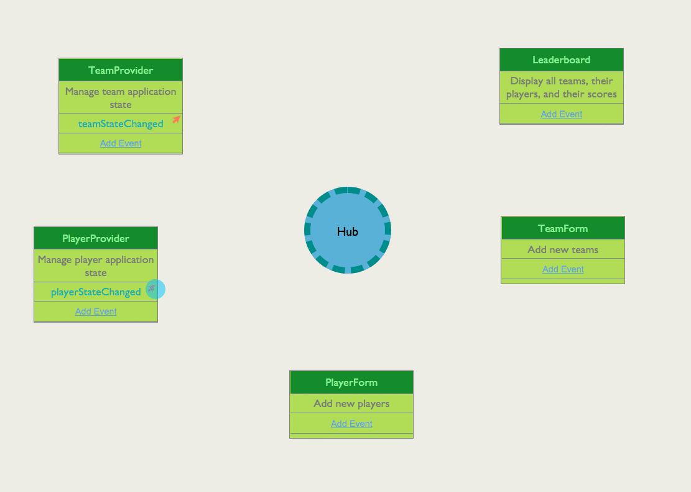

# Creating New Players

When the user enters in a new player, capture the click of the _Add Player to Team_ button and have the **`PlayerProvider`** update the API state with a `fetch()` method call, and then update the application state once that is complete.

The **`Leaderboard`** component should react when the application's player state changes and re-render itself with the new state.

## Example UI

## Event Flow

