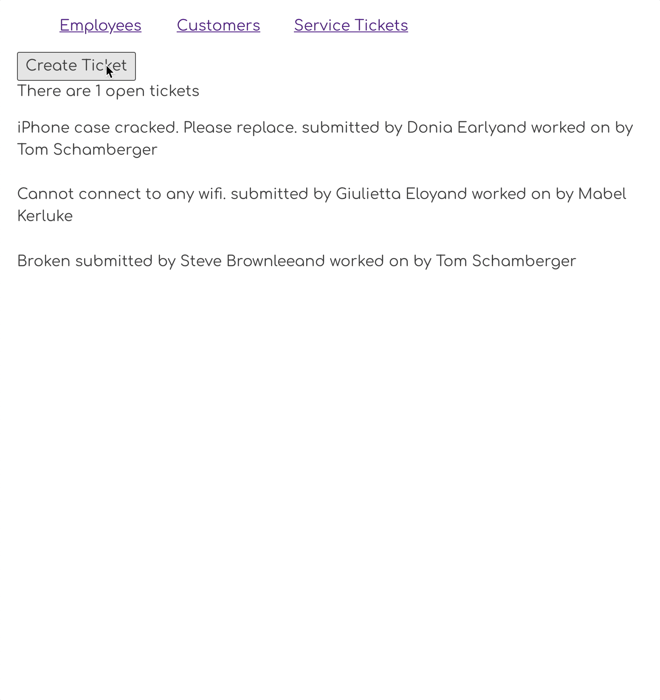

# Creating Service Tickets

## Goal

In this chapter, you are going to write a component whose responsibility is to create a new service ticket.



## React to User Input

1. Content about initial state object.
1. Talk about how `onChange` creates copies, modifies copy, and then updates state.
1. Talk about how crucial the `value` attribute is and that is reflects current state.
1. Talk about `onClick` for initiating POST operation.
1. Talk about redirecting the user once POST is complete.

> ##### `src/components/serviceTickets/TicketForm.js`

```jsx
import React, { useContext, useEffect, useState } from "react"
import { useHistory } from 'react-router-dom';

export const TicketForm = () => {
    const [ticket, update] = useState({
        description: "",
        emergency: false
    });

    const history = useHistory();

    const saveTicket = (event) => {
        event.preventDefault()

        if (ticket.description === "") {
            window.alert("Please enter a description for the ticket")
        } else {
            const fetchOptions = {
                "method": "POST",
                "headers": {
                    "Content-Type": "application/json"
                },
                "body": JSON.stringify({
                    description: ticket.description,
                    emergency: ticket.emergency,
                    customerId: parseInt(localStorage.getItem("honey_customer")),
                    employeeId: 1
                })
            }
            return fetch("http://localhost:8088/serviceTickets", fetchOptions)
                .then(res => res.json())
                .then(() => history.push("/tickets"))
        }
    }

    return (
        <form className="ticketForm">
            <h2 className="ticketForm__title">New Service Ticket</h2>
            <fieldset>
                <div className="form-group">
                    <label htmlFor="description">Description:</label>
                    <input
                        required autoFocus
                        type="text"
                        className="form-control"
                        placeholder="Brief description of problem"
                        value={ticket.description}
                        onChange={(evt) => {
                            const copy = {...ticket}
                            copy.description = evt.target.value
                            update(copy)
                        }} />
                </div>
            </fieldset>
            <fieldset>
                <div className="form-group">
                    <label htmlFor="name">Emergency:</label>
                    <input
                        type="checkbox"
                        checked={ticket.emergency}
                        onChange={(evt) => {
                            const copy = {...ticket}
                            copy.emergency = evt.target.checked
                            update(copy)
                        }} />
                </div>
            </fieldset>
            <button className="btn btn-primary" onClick={saveTicket}>
                Submit Ticket
            </button>
        </form>
    )
}
```

## Button to Show the Form

Add a button to the top of your ticket list that will change the browser URL in order to show the ticket form.

```jsx
<div>
    <button onClick={() => history.push("/ticket/create")}>Create Ticket</button>
</div>
```

Make sure you import `useHistory()` into the component to make this work. This is a hook provided by the React Router DOM library that you installed. It grants you the ability to programtically manipulate the browser URL instead of waiting for a user to click on a `<Link>` component.

```js
const history = useHistory()
```

## Create the Route

Create the new route that will respond when the button click changes the URL to `/ticket/create`.

> ##### `src/components/ApplicationViews.js`

```jsx
<Route path="/ticket/create">
    <TicketForm />
</Route>
```

You should now be able to add new support tickets. If something doesn't work, check your code for spelling errors, and talk to your teammates.

If you still can't make it work, reach out to your instruction team immediately.

## Practice: Hire Employee

Write a component whose responsibility is to hire a new employee and assign to a location.

### Create an Employee Form Component.
* Create a route in ApplicationViews for `/employee/create` that renders an EmployeeForm.
* Add a button to the employee list labeled, "Hire Employee".
* When the button is clicked, show the employee form by using `history.push()` to change the route.
* The employee form should include an input for the person's name, their repair specialty, and a button at the end labeled "Finish Hiring".
* When the "Finish Hiring" button is clicked on the form, create a new employee object and POST it to the API.
* Once the employee is saved, re-route the user to the list of employees.
