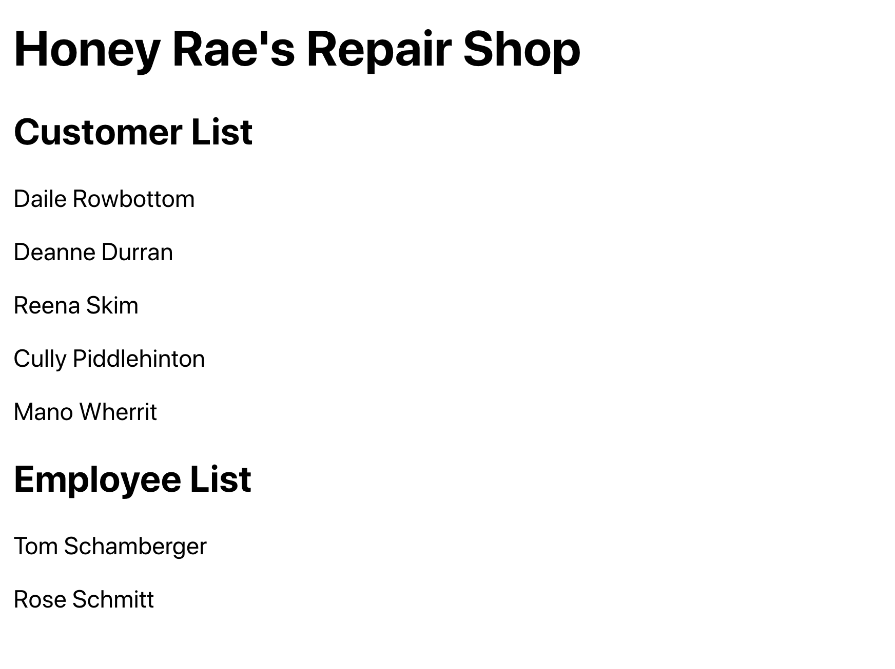

# Honey Rae's Customers Revisited

Having all of the logic for displaying a list of customers inside the main **`Repairs`** component is not a good, long-term solution.

Just like in previous projects, the initial component's responsibility is to define the overall structure of the application. It defers the construction of the HTML for displaying the data to other components.

## Starter Code

Put the following starter code in the **`CustomerList`** module that you created on project setup.

> #### `src/components/customers/CustomerList.js`

```js
import React, { useEffect, useState } from "react"

export const CustomerList = () => {

}
```

## Video: Customer List Component

Watch the [Honey Rae's Repairs - Customer List Component](https://vimeo.com/568224637) video to ensure that you follow the Single Responsibility Principle in your components.

## Employee List

Your job is to create an employee list components and have the names of the employees listed below the names of the customers.



Try it yourself, or with your teammates to discuss your strategy and practice vocabulary. If you get stuck, you can watch a bonus video that shows you how to do it.