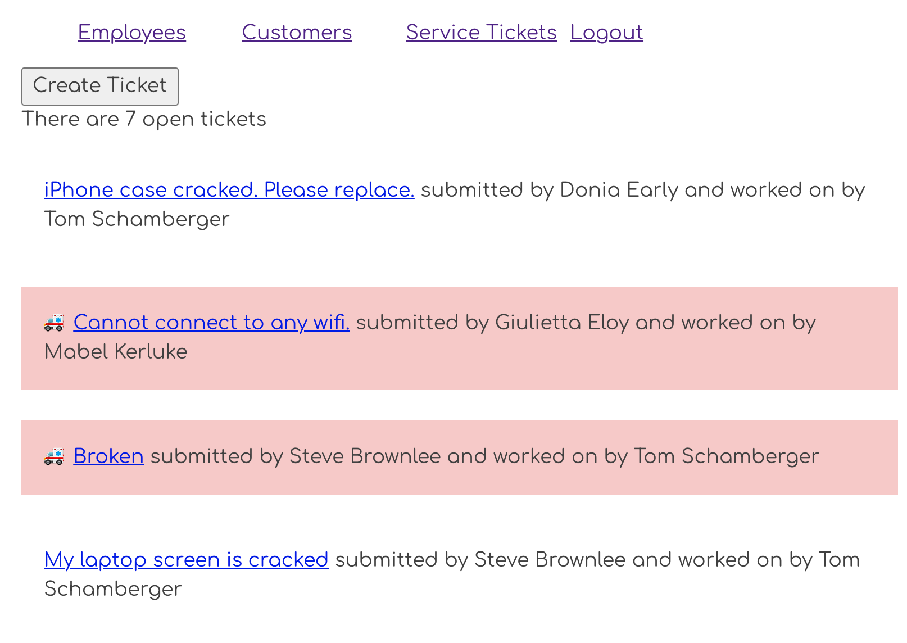

# Viewing Single Tickets

Since a ticket is automatically assigned to the employee with a primary key of 1, you need a way to reassign the ticket. Surely, the first employee in the database won't be working on all the tickets.

## View a Single Ticket

The first step is to view a single ticket after clicking on it in the list. To do this, you will use the `<Link>` component to make the descriptions into hyperlinks. Open the ticket list component and update the code to the following.

```jsx
<Link to={`/tickets/${ticket.id}`}>{ticket.description}</Link>
```

Verify that each description is now a hyperlink.




## Single Ticket Component

The next step is to create a new component in the `serviceTickets` directory which will be responsible for showing the details of a single ticket, which can then be used to modify it.

This component will also use the `useParams()` hook function from the `react-router-dom` library. It allows your code to read a route parameter from the URL.

> In the following URL, `5` is the route parameter
>
>   http://localhost:5000/animals/5

Create the following module and add the code.

> #### `/src/components/serviceTickets/Ticket.js`

```jsx
```

## Create a Dynamic Route

A dynamic route component is one that matches a pattern. Notice the route that renders **`Ticket`** component. The `ticketId` is a parameter specified in the URL.

```js
<Route exact path="/tickets/:ticketId(\d+)">
    <Ticket />
</Route>
```

It has `:ticketId(\d+)` at the end of the URL. If the URL is http://localhost:3000/tickets/3, the value of 3 will be stored in a variable named `ticketId`. The variable can then be used inside **`Ticket`** component.

Look back at the code you put in the detail component.

See the `const { ticketId } = useParams();`

This is how you access the number 3 inside the component. It's part of the routing package (react-router-dom) you installed. Don't worry, that one's tricky. We'll help you remember it.

## View a Ticket Detail


## Practice: Employees

Make ech emplyee's name a hyperlink. When the name is clicked display that single employee's details.
