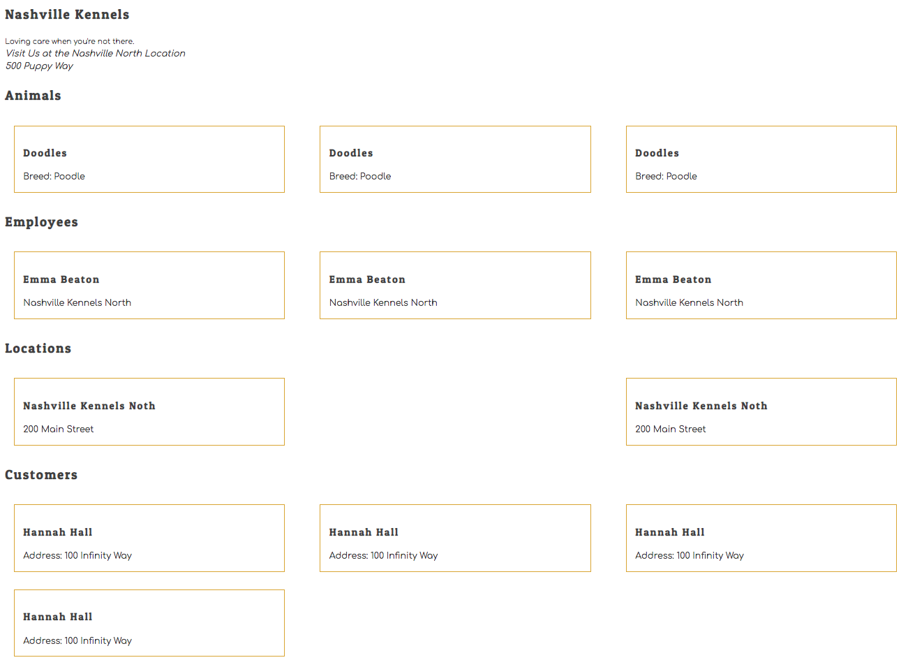

# Getting Started with React

React is a library that was open sourced by the development team at Facebook with the sole purpose of managing how data is displayed to the user. It doesn't care about the database, it doesn't care how data is retrieved, and it doesn't care about how complex the rest of the application is.

You've already learned the vast majority of what React does for you when building the UI for your application.

1. Building components and child components
1. Modular code with JavaScript modules
1. Updating the DOM with document elements or string templates
1. Setting the state of a component

## Installing React Developer Tools

You can install the React Developer Tools via the [Chrome Store](https://chrome.google.com/webstore/detail/react-developer-tools/fmkadmapgofadopljbjfkapdkoienihi).
You will get two new tabs in your Chrome DevTools:

* ⚛️ Components
* ⚛️ Profiler

These tools will help you debug and inspect your React applications.

## Getting Started with create-react-app

```sh
cd ~/workspace
npx create-react-app kennels
# Wait for installation to complete
cd kennels/src
rm App*
```

### Getting Setup

Before we grow this application, let's create a meaningful directory structure.

1. Inside your `src` directory, `mkdir` a `components` sub-directory.
2. `cd` into the `components` directory.
3. `touch` `Kennel.js` and `Kennel.css`.
4. Within components, `mkdir` an `animal` directory
5. `cd` into the `animal` directory.
6. `touch Animal.js Animal.css`

```
- src
    - components
        - animal
            - Animal.js
            - Animal.css
        - Kennel.js
        - Kennel.css
  index.js

```

## Getting Started with Components

### Single Component

Here is a simple example of a React component. ***Please read through the following code snippets and ask questions prior to writing any code.***

> src/components/Kennel.js

```jsx
import React from "react"
import "./Kennel.css"

export const Kennel = () => (
    <>
        <h2>Nashville Kennels</h2>
        <small>Loving care when you're not there.</small>
        <address>
            <div>Visit Us at the Nashville North Location</div>
            <div>500 Puppy Way</div>
        </address>
    </>
)
```

Some of this looks familiar... *sort of*. This is simply another way of defining a component function that returns an HTML representation of a kennel.

That stuff that looks like HTML? *It's not*. It's called [JSX](https://reactjs.org/docs/introducing-jsx.html), and it basically allows us to write JavaScript that looks like HTML in our code. With JSX, we can better visualize the eventual rendered HTML structure.

Even though we write `<Kennel>` in React code, which looks like an HTML element, you should consider each one of your components as a [factory function](https://www.sitepoint.com/factory-functions-javascript/), which is just a function that returns an object.

**What is `<>` and `</>`?**

Remember, *a function can only return one thing*. This is a `React.Fragment` which gives us the ability to wrap the content, and return one item.

To display our `Kennel` component, we need to modify the `index.js` file. This file, `index.js`, is the **entry file**, or *the first JavaScript file that runs in our app*.

> ##### `src/index.js`

```js
import React from "react"
import ReactDOM from "react-dom"
import { Kennel } from "./components/Kennel"

ReactDOM.render(
  <React.StrictMode>
    <Kennel />
  </React.StrictMode>,
  document.getElementById('root')
);
```

## Starting Your React Application

In your terminal, make sure you are in the top-level project directory, and not in the `public` or `src` sub-directory, and type the following command.

```sh
npm start
```

It will take about 30 seconds to run all of your code, and then the process will automatically open a new tab in your browser and then render your HTML.

### Child Component

After the Nashville Kennels company information, we want to list all of the animals. We *could* hard code them inside the Kennel component, but as professional software developers, we will adhere to the **[Single Responsibility Principle](https://en.wikipedia.org/wiki/Single-responsibility_principle)**, and create a *separate component* for displaying an animal.

Consider how we have structured our previous projects, and make a new file specific to the animal display, then copy pasta the following code into the file.

> ##### `src/components/animal/Animal.js`

```jsx
import React from "react"
import "./Animal.css"

export const Animal = () => (
    <section className="animal">
        <h3 className="animal__name">Doodles</h3>
        <div className="animal__breed">Breed: Poodle</div>
    </section>
)
```

This component can be included as a child of the **`Kennel`** component. Look at the code below and notice the custom element `<Animal />`. React interprets this as a component, and will run the function that you imported from `Animal.js`, and then render the JSX that it defines.

Update your **`Kennel`** component with the code provided below. Be sure to import the **`Animal`**. Now when the **`Kennel`** component is rendered it will display 3 child **`Animal`** components.

> ##### `src/components/Kennel.js`

```jsx
import React from "react"
import { Animal } from "./animal/Animal"
import "./Kennel.css"

export const Kennel = () => (
    <>
        <h2>Nashville Kennels</h2>
        <small>Loving care when you're not there.</small>

        <address>
            <div>Visit Us at the Nashville North Location</div>
            <div>500 Puppy Way</div>
        </address>

        <h2>Animals</h2>
        <article className="animals">
            <Animal />
            <Animal />
            <Animal />
        </article>
    </>
)
```

## Kennel Styles
In React, we add classes to a component with `className` instead of `class`.

> ##### `src/components/Kennel.css`

```css
/* Import the google web fonts you want to use */
@import url("https://fonts.googleapis.com/css?family=Comfortaa|Patua+One");

/*Typography
--------------------------------------------------------------*/
body,
button,
input,
select,
textarea {
  color: #404040;
  font-family: "Comfortaa", Arial, sans-serif;
  font-size: 14px;
  line-height: 1.5;
}

h1, h2, h3, h4, h5, h6 {
  font-family: "Patua One", serif;
  letter-spacing: 2px;
}

p {
  margin-bottom: 1.5em;
  color: #d6fcff;
  color: darkslateblue;
}

strong {
  font-weight: bold;
}

address {
  margin: 0 0 1.5em;
}
```

## Animal Styles

> ##### `src/components/animal/Animal.css`

```css

.animals {
  display: flex;
  flex-wrap: wrap;
  justify-content: space-between;
}

.animal {
    flex-basis: 28%;
    margin: 1em;
    padding: 1em;
    border: 1px solid goldenrod;
}
```

## Practice

The Nashville Kennel application needs to include locations, owners, and employees.

Create static components for each, and corresponding CSS files. Make sure you create different sub-directories for each kind of resource.

Remember the Single Responsibility Principle. You should have a component whose sole responsibility is to render information about a location, another for a customer, and another for an employee.

Update **`Kennel.js`** to show:

* 2 locations
* 4 customers
* 3 employees

Yes, each one will display the identical information. This is just to practice making components. You'll be making real, data-driven components soon.


