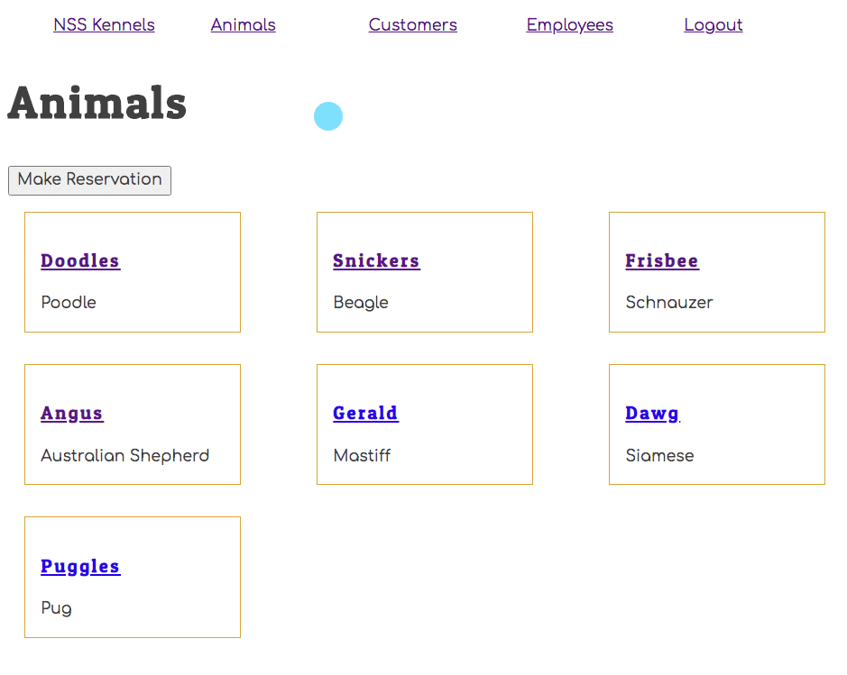
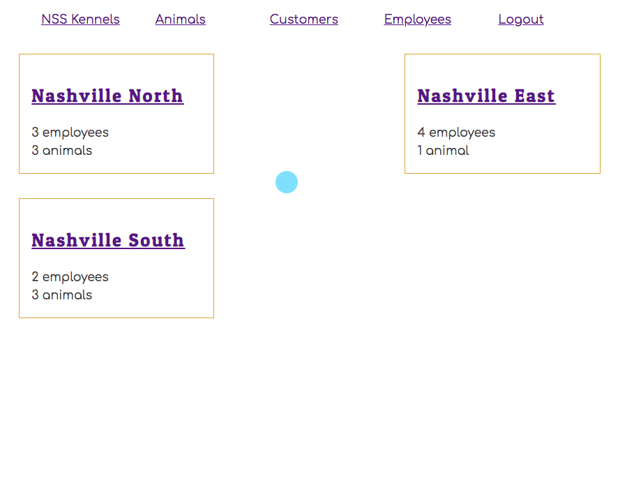

# Individual Animal Component

Currently, you display all of the animal information directly inside the `map()` method in the **`AnimalList`** component. The next step is to clean up the animal list to show minimal information, and let the user click on an animal name to show more details in a different view.

## Showing Animal Name as Hyperlink

The first step is to show only the animal's name in the list, and make it a hyperlink to the user can click on each name.

> #### `/src/components/animal/AnimalList.js`

```jsx
import React, { useState, useContext, useEffect } from "react"
import { AnimalContext } from "./AnimalProvider"
import { Animal } from "./Animal"
import "./Animals.css"

export const AnimalList = ({ history }) => {
    const { getAnimals, animals } = useContext(AnimalContext)

    // Initialization effect hook -> Go get animal data
    useEffect(()=>{
        getAnimals()
    }, [])

    return (
        <>
            <h1>Animals</h1>

            <button onClick={() => history.push("/animals/create")}>
                Make Reservation
            </button>

            <div className="animals">
                {
                    animals.map(animal => <Link to={`/animals/detail/${animal.id}`}>
                          { animal.name }
                        </Link>
                    )
                }
            </div>
        </>
    )
}
```

## New Animal Details Component

The next step is to create a new component in the animal directory which will be responsible for showing all the details of an animal.

This component will also user the `useParams()` hook function from the `react-router-dom` library. It allows your code to read a route parameter from the URL.

> In the following URL, `5` is the route parameter
>
>   http://localhost:5000/animals/5

Create the following module and add the code.

> #### `/src/components/animal/AnimalDetail.js`

```jsx
import React, { useContext, useEffect, useState } from "react"
import { AnimalContext } from "./AnimalProvider"
import "./Animal.css"
import { useParams } from "react-router-dom"

export const AnimalDetail = () => {
    const { animals } = useContext(AnimalContext)
    const [ animal, setAnimal ] = useState({ location: {}, customer: {} })

    /*
        Given the example URL above, this will store the value
        of 5 in the animalId variable
    */
    const { animalId } = useParams();


    useEffect(() => {
        const thisAnimal = animals.find(a => a.id === animalId) || { location: {}, customer: {} }

        setAnimal(thisAnimal)
    }, [animalId])

    return (
    <section className="animal">
        <h3 className="animal__name">{ animal.name }</h3>
        <div className="animal__breed">{ animal.breed }</div>
        <div className="animal__location">Location: { animal.location.name }</div>
        <div className="animal__owner">Customer: { animal.customer.name }</div>
    </section>
    )
}
```

## Create a New Dynamic Route

A dynamic route component is one that matches a pattern. Notice the route that renders **`AnimalDetail`**. The `animalId` is a parameter passed on the URL.

```js
<Route exact path="/animals/detail/:animalId(\d+)">
    <AnimalDetail />
</Route>
```

It has `:animalId(\d+)` at the end of the URL. If the URL is http://localhost:3000/animals/detail/3, the value of 3 will be stored in a variable named `animalId`. The variable can then be used inside **`AnimalDetail`**.

Look back at the code you put in the detail component.

See the `const { animalId } = useParams();`

This is how you access the number 3 inside the component. It's part of the routing package (react-router-dom) you installed. Don't worry, that one's tricky. We'll help you remember it.


Within ApplicationViews, add the route for animal details within the **AnimalProvider** component. You will need to support a route like the following.

http://localhost:3000/animals/7

> ##### `/src/components/ApplicationViews.js`

```js
<AnimalProvider>
   <Route exact path="/animals/detail/:animalId(\d+)">
		<AnimalDetail />
	</Route>
</AnimalProvider>
```

## Try it Out

Now when you click on an animal's name in the list view, you should see your new animal detail view.



## Practice: Employees

Refactor your employee components. Start with a list of employee names that when clicked, displays the full details about an employee.

## Practice: Locations
Refactor your location components. Start with your location list and display the location name, the number of employees, and the number of animals currently being treated for each location.

When you click the name of a location, you should be taken to a detail view that lists the names of all animals currently being treated, and the names of all employees working there. You can use the json-server feature: `_embed`.

Your starting API call will look similar to this:

```js
http://localhost:8088/locations?_embed=employees_embed=animals

```

How do you return the information about one location?

> **Tip:** You don't need all of the fancy styling like you see below. Just get the information displayed.


