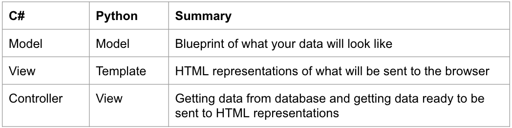
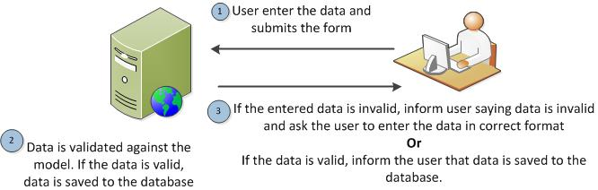
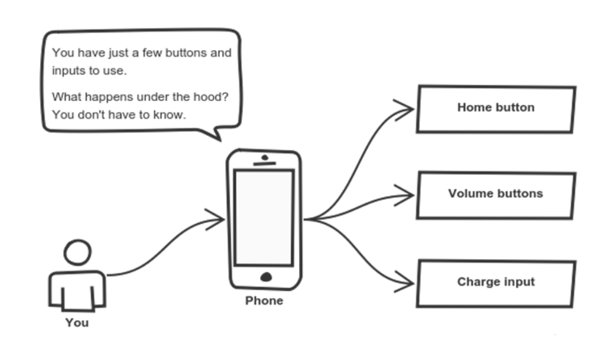
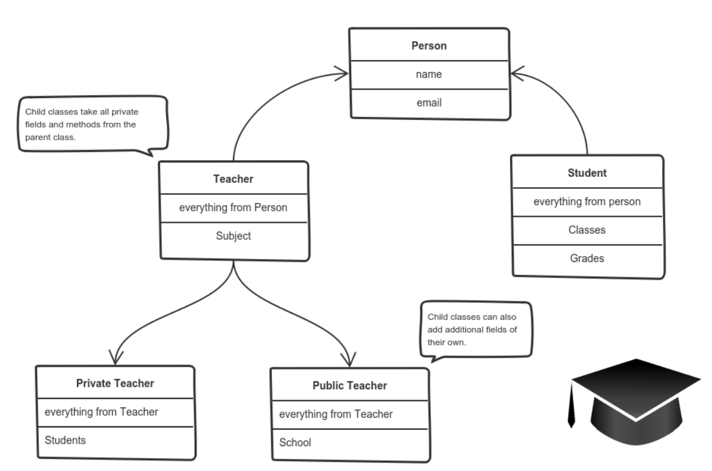
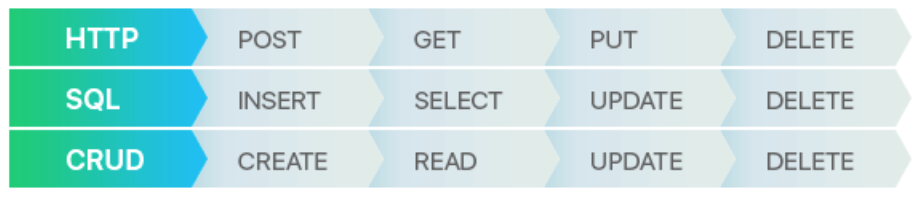

# Computer Science & Backend Concepts

## Definitions included in this document
### General Vocab - Python and C#
1. Classes
1. Model, View, Template / Model, View, Controller
1. SQL
1. ORM
1. API (general description)
1. Method Overriding

### General Vocab - Python Specific - TODO
1. Python
1. Django
1. Class based vs function based views
1. Raw SQL in Python
1. Django REST Framework

### General Vocab - C# Specific - TODO
1. ViewModels
1. ADO .NET
1. Interfaces
1. Entity Framework

### Software Development / Computer Science-y Terms
1. Testing
1. Integration Testing
1. Test Driven Development
1. Unit Testing
1. Internet stuff
1. Request/Response Cycle
1. Client Side Validation
1. Server Side Validation
1. Object Oriented Programming
1. Encapsulation
1. Abstraction
1. Inheritance
1. Polymorphism
1. Interfaces 
1. Composition over Inheritance
1. Method Overloading
1. Web App
1. REST API
1. Idempotency


---

### Classes
[Python Class Resources](https://medium.com/the-renaissance-developer/python-101-object-oriented-programming-part-1-7d5d06833f26)
[C# Class Resources](https://docs.microsoft.com/en-us/dotnet/csharp/programming-guide/classes-and-structs/classes)

Python and C# are object-oriented programming languages. We use classes to keep related things together. A class can have attributes and/or methods. 

Objects are a representation of the real world objects like cars, dogs, bike, etc. The objects share two main characteristics: data and behavior.

Cars have data like number of wheels, number of doors, seating capacity and also have behavior: accelerate, stop, show how much fuel is missing and so many other.

We call data as attributes and behavior as methods in object oriented programming. 

A Class is the blueprint from which individual objects are created. In the real world we often find many objects with all the same type. Like cars. Most cars have an engine, wheels, doors, etc. Each car was built from the same set of blueprints and has the same components.

Python example:
```python
class Vehicle:
    def __init__(self, number_of_wheels, seating_capacity, color):
        <!-- These are properties that define what a Vehicle looks like -->
        self.number_of_wheels = number_of_wheels
        self.seating_capacity = seating_capacity
        self.color = color

    <!-- This is a method that defines a behavior of the Vehicle -->
    def make_noise(self):
        print('VRUUUUUUUM')
```
C# example:
```cs
public class Vehicle
{
    <!-- These are properties that define what a Vehicle looks like -->
    [Key]
    public int VehicleId { get; set; }

    [Display(Name="Number of Wheels")]
    [Required]
    public int NumberOfWheels { get; set; }

    [Display(Name="Seating Capacity")]
    [Required]
    public int SeatingCapacity { get; set; }

    [Display(Name="Is car sold")]
    [Required]
    public boolean IsSold { get; set; } = False

    <!-- This is a method that defines a behavior of the Vehicle -->
    public void MakeNoise()
    {
        Console.WriteLine("VRUUUUUM");
    }
}
```
---
### MVT/MVC

Both Python and C# use an architectural pattern with similar signal flows to get/post data from your database, prepare/manipulate that data, and then render that data on the browser.  



* **Model**: Describes your data - the single source of truth for your data
  * Blueprint of how your data is structured 
* **View** (Python) / **Controller** (C#): Controls what users see 
  * Most of your business logic is going to happen here 
  * This is similar to your API Manager or whatever it was called in frontend to do CRUD and other ways to manipulate/access your data from your database
* **Template** (Python) / **View** (C#): How the user sees it 
  * It’s fancy HTML!
  * You can do simple logic in a template - if statements, loops

Typical flow: 
1. User requests something from the browser (GET request, POST request, etc.)
1. View(Python)/controller(C#) queries the database and gets the requested data
1. View(Python)/controller(C#) returns that data to the template(Python)/view(C#)
---
### SQL Structured Query Language 
A language to query/interact with the data in our database

#### What’s a JOIN in SQL? 
Bringing data together, at the point where there is an intersection of data. You’ll see below that the intersection between song and album is the album id, which is the primary key on Album and a foreign key on Song.
```sql
select count() as "number of songs", al.title "Album Title"
from Song s
join Album al on al.albumid = s.albumid 
group by al.albumid
```

#### What does a WHERE do in SQL? 
Conditional logic to filter the returned dataset based on a certain parameter
```sql
insert into Album
select null, "the title", "2019", 234, "label", artist.ArtistId, Genre.GenreId
from artist, Genre
where Artist.ArtistName = "Black Flag"
and Genre.Label = "Punk"
```

#### What is a subquery in SQL? 
A query within another query. In this code below, you’ll see that I am selecting the employee who has the max sales for 2009. That select statement has _another_ select statement within it that calculates the total sales for every employee in the database.
```sql
SELECT Top2009Sales.EmployeeName AS "EmployeeName", MAX(Top2009Sales.Sales) AS "Sales"
FROM (
	SELECT e.FirstName || " " || e.LastName AS "EmployeeName", SUM(i.Total) AS "Sales"
	FROM Employee e, Invoice i, Customer c
	WHERE i.CustomerId == c.CustomerId
	AND c.SupportRepId == e.EmployeeId
	AND i.InvoiceDate BETWEEN "2009-01-01" AND "2009-12-31"
	GROUP BY "EmployeeName"
) AS "Top2009Sales";
```

#### What are some aggregate functions in SQL? 

MAX, MIN, COUNT allow you to perform operations on the data in the database (See MAX and SUM from the example above)

---
### ORM (Object Relational Mapper)
A tool that lets you query and manipulate data from a database using an object-oriented paradigm. When talking about ORM, most people are referring to a library that implements the Object-Relational Mapping technique, hence the phrase "an ORM". 

English explanation of ORM: So, if you aren’t using an ORM, you’d be writing raw SQL queries in your code to interact with data in the database. An ORM abstracts all that away so you don’t see any SQL queries (but it’s happening behind the scenes!). 

Python ORM Example to get all Departments from database:
```python
departments = Department.objects.all()
```

C# Entity Framework Example to get all Departments from database:
```cs
public async Task<IActionResult> Index()
{
    return View(await _context.Department.ToListAsync());
}
```
---
### API (Application Programming Interface)
You built a JSON based API using json-server - woot! But you couldn’t really set any restrictions beyond CRUD on that API. A traditional API allows businesses to share their data so people can use their data to create different apps. Beyond that, you can add all sorts of logic to your API so that users can get different responses based on their requests.

---
# Testing

### Integration Testing
Tests typically written after the functional code is written. These tests are to ensure that if someone makes any changes to code, your functionality won’t break. For example, if you require certain fields to be completed on a POST and someone were to remove a field, the test would fail, so the developer would know that field is necessary.

### Test Driven Development
Kind of the reverse of integration testing. You write the test before you write any code working on actual functionality. You typically write the test to fail first, and then work to get it to pass, in small chunks.

### Unit Testing
Test very small parts of your code - the smallest testable part of your code.

---

### Request / Response cycle
User requests something from the server through the URL and the server responds with some sort of [response code](https://http.cat/) and/or the stuff the browser needs to render the response. [More reading.](https://developer.mozilla.org/en-US/docs/Learn/Getting_started_with_the_web/How_the_Web_works)

### Client side validation
You know when you enter in an email and it yells at you till you put the @gmail.com at the end (sometimes even before you’ve submitted the form)? That’s often client side validation - just some javascripty type stuff saying “I am expecting an email address and the user is/isn’t giving me that email I want”. Notice how I said “often” client side validation - sometimes this type of error is also given from a server side validation. 

### Server side validation
Once the data passes the client side validation, it moves on to interact (`POST`/`DELETE`, etc) with the database. You’ll get a server side validation error if you try to do something to the database that isn’t allowed (based off of the models you create in your Django app). So, if on the model, you said that the max length of a name is 50 characters, and someone enters a name at 55 characters, it will pass the client side, but it will fail on the server side.




# Software Development General Vocab

This section covers common questions that NSS grads get asked in interviews. Is it great these questions are asked in interviews for junior dev positions? *_No_*. But, companies are lazy with interviewing so they come up with these types of questions to pad the interview and make sure it seems like they are doing their job of sufficiently interviewing for a dev position. 

Whenever possible, when asked these questions, give a simple definition and then an example of it in use (like an example from a time you used the concept in a group or individual project or something); this is a great way to show you understand the concept in practice, rather than just regurgitating a Webster’s dictionary definition.

---

### Object oriented programming (OOP)
[Resource](https://medium.freecodecamp.org/object-oriented-programming-concepts-21bb035f7260)
The four principles of object-oriented programming are encapsulation, abstraction, inheritance, and polymorphism.

---

### Encapsulation
[Code Example - Python](https://pythonprogramminglanguage.com/encapsulation/)

[Another Python Example](https://medium.com/the-renaissance-developer/python-101-object-oriented-programming-part-2-8e0db3ddd531)

Each object keeps its state private, inside a class. Other objects don’t have direct access to this state. If you want to communicate with the object, you should use the methods provided. But (by default), you can’t change the state. Python doesn’t have a way to actually protect an object’s state, but there is the convention of using `__` before the property to signal private. In C#, the word `private` is used.

Below is a Python class. 
Line 3: a publicly accessible property
Line 4: a privately accessible property
Line 6: a public setter method to allow ability to update the email property
Line 9: a public getter method to access the email data
```python
1 class Person:
2    def __init__(self, first_name, email):
3        self.first_name = first_name
4        self._email = email
5
6    def update_email(self, new_email):
7        self._email = new_email
8
9    def email(self):
10        return self._email
```
```python
# Using the code:
tk = Person('TK', 'tk@mail.com')
print(tk.email()) # => tk@mail.com
# tk._email = 'new_tk@mail.com' -- treat as a non-public part of the class API
print(tk.email()) # => tk@mail.com
tk.update_email('new_tk@mail.com')
print(tk.email()) # => new_tk@mail.com
```
C# example:
```cs
// Base class
public class Automobile {

    public string Accelerate() {
        InjectFuel();
        return "zoom";
    }

    private string InjectFuel() {
        return "fueling";
    }
}

// Usage Example in a Program.cs file somewhere
Automobile generic_auto = new Automobile();
Console.WriteLine($"Automobiles go {generic_auto.Accelerate()}");

// However, the following line of code does not compile
generic_auto.InjectFuel();
```

---

### Abstraction
Each object should only expose a high-level mechanism for using it and should hide internal implementation details. It should only reveal operations relevant for the other objects.

Another example, you want to make things run - you create a run function and are able to call it on human/animal instances to make those instances run. If you were to abstract this method, the other developers wouldn’t be able to really see the code behind your run function, but they know that they can do `human_instance.run()` and it will make that instance run. 

Another example that’s abstracted away from you: 
Django ORM and Entity Framework ORM - you don’t see the SQL behind the scenes in this code, but that’s what it is doing to interact with your database - imagine everything under the hood to get the `get_object_or_404` or the `_context.Department.ToListAsync()` method to work! You don’t have to worry about how it does what it does, because it’s just there for you to use and you know how to use it.

---

### Inheritance
[Code Example (Python)](https://www.geeksforgeeks.org/inheritance-in-python/)

[C# Resource](https://docs.microsoft.com/en-us/dotnet/csharp/tutorials/inheritance)

How do we reuse the common logic and extract the unique logic into a separate class? One way to achieve this is inheritance.

It means that you create a (child) class by deriving from another (parent) class. This way, we form a hierarchy.

In the image below, a private teacher is a type of teacher. And any teacher is a type of Person.

Each class adds only what is necessary for it while reusing common logic with the parent classes.



So here’s a parent class in Python:
```python
class Ball:
    def __init__(self):
        self.radius = 0
        self.weight = 0
```

Both Baseball and Soccerball inherit the Ball class and then add their own properties that are specific to the class of Baseball and Soccerball.
```python
class Baseball(Ball):
    def __init__(self):
        self.stitches = 0

class SoccerBall(Ball):
    def __init__(self):
        self.panels = 0
```
C# version of inheritance:
```cs
public class Ball {
    public int radius = 0;
    public int weight = 0;
}

public class Baseball : Ball {
    public int stitches = 0;
}

public class SoccerBall : Ball {
    public int panels = 0;
}
```

---

### Polymorphism
[Code Example (Python)](https://www.geeksforgeeks.org/polymorphism-in-python/)

[C# Polymorphism](https://docs.microsoft.com/en-us/dotnet/csharp/programming-guide/classes-and-structs/polymorphism)

A way to use a class exactly like its parent so there’s no confusion with mixing types. But each child class keeps its own methods as they are. This typically happens by defining a (parent) interface to be reused. It outlines a bunch of common methods. Then, each child class implements its own version of these methods.

There are 2 types of polymorphism: class based and method based.

Method based:

You can use the same method on different types.

Python: 
```python
# len() being used for a string 
print(len("geeks")) 

# len() being used for a list 
print(len([10, 20, 30])) 
```

Class based: 
Below code shows how Python can use two different class types, in the same way. We create a for loop that iterates through a tuple of objects. Then call the methods without being concerned about which class type each object is. We assume that these methods actually exist in each class.
```python
class India(): 
	def capital(self): 
		print("New Delhi is the capital of India.") 

	def language(self): 
		print("Hindi the primary language of India.") 

class USA(): 
	def capital(self): 
		print("Washington, D.C. is the capital of USA.") 

	def language(self): 
		print("English is the primary language of USA.") 

obj_ind = India() 
obj_usa = USA() 
for country in (obj_ind, obj_usa): 
	country.capital() 
	country.language() 
```

---

### Interfaces
_This applies to C# more than Python_

[C# NSS Chapter](https://github.com/nashville-software-school/bangazon-inc/blob/master/book-1-orientation/chapters/INTERFACES_INTRO.md)  (with lots of other great resources linked)


The combination of all public methods and properties of an object form the object's public interface. In other words, the public methods and properties form a group of rules that you can depend on. Interfaces define the required behavior for something to be considered a specific type of thing. They do not actually contain the required functionality. An interface is often called a contract.

Imagine a `Pen` class. There are `line()` and `circle()` methods as public methods in `Pen`. You can call them anytime in your code. By contract, being a `Pen` means always having those two methods available and public.

Consider the following reasoning:
`Pen`'s public interface consists of two methods named `line()` and `circle()`
`FountainPen` and `RollerBallPen` descend from `Pen`
Therefore `FountainPen` and `RollerBallPen` can be used to fulfill the same contract as `Pen`, and “draw” a line or circle

---

### Composition over Inheritance

[Python Resource](http://blog.thedigitalcatonline.com/blog/2014/08/20/python-3-oop-part-3-delegation-composition-and-inheritance/)

[C# Resource](https://scottlilly.com/c-design-patterns-composition-over-inheritance/)

Some devs find that it is better to have DRY code through composition rather than inheritance. Composition is containing instances of other classes that have the preferred functionality in the class, rather than inheriting that functionality from a parent class.

The idea is that composition allows for more flexibility, ability to change and maintain code easier and keeps systems simpler and decouples the system.

You can see inheritance above, but remember when you has a User Model and a Customer Model? The Customer model had an instance of a User as one of the properties. That’s composition!

```python
class Customer(models.Model):
    user = models.OneToOneField(
        User,
        on_delete=models.DO_NOTHING,
        primary_key=True,
    )
    address = models.CharField(max_length=255)
    phoneNumber = models.CharField(max_length=255)
    deleted = models.BooleanField(default=False)
```

---

### Method overloading
[Python Resource](https://pythonspot.com/method-overloading/)

You can define a method that can be used multiple ways. So for a single method, you can have it take a different number of arguments. That single method could be called with zero, one, two, etc parameters.

```python
# Here’s a method that can accept either no arguments or one argument:
obj.sayHello()
obj.sayHello('Guido')

# The output is different, depending on the number or parameters passed in:
Hello
Hello Guido
```

Here’s the code for method overloading example above. The conditional allows different functionality, depending on the number of parameters sent when the method is called.
```python
class Human:
 
    def sayHello(self, name=None):
 
    if name is not None:
        print 'Hello ' + name
    else:
        print 'Hello '
 
# Create instance
obj = Human()
 
# Call the method
obj.sayHello()
 
# Call the method with a parameter
obj.sayHello('Guido')
```

In C#, this is really common when handling a `GET` and `POST` for a form - both methods are called `Create`. The first method doesn't take any arguments, so the form is rendered. The second method takes argument(s), so that method is run.
```cs
 // GET: PaymentTypes/Create
public IActionResult Create()
{
    return View();
}

// POST: PaymentTypes/Create
[HttpPost]
[ValidateAntiForgeryToken]
public async Task<IActionResult> Create([Bind("PaymentTypeId,AccountNumber,UserId")] PaymentType paymentType)
{
    var user = await GetCurrentUserAsync();
        paymentType.User = user;
        paymentType.UserId = user.Id;

// more code goes here, of course ;)
```

---

### Web App
A web app is a server based app that allows interaction with the database and sends HTML representations to the browser. So a Django/.NET web app not only has models, and views (controller), but a view binds data to an HTML template (view) which is then sent to the browser. 

---

### REST API 
[Resource](https://mlsdev.com/blog/81-a-beginner-s-tutorial-for-understanding-restful-api)

[Another Resource](https://en.wikipedia.org/wiki/Representational_state_transfer) (in particular, the architectural properties)

[Seriously, another resource](https://simpleisbetterthancomplex.com/tutorial/2018/02/03/how-to-use-restful-apis-with-django.html) ;) - Python specific, but great for anyone to read 

In short, a REST API an intuitive way for clients to access the data on a server. REST is not a standard or protocol, this is an approach to or architectural style for writing API.

There are 6 different guiding restraints for an API to be considered truly ReSTful. [More reading](https://restfulapi.net/).

RESTful APIs depend on the HTTP CRUD methods.



All resources in REST are entities. They can be independent like:
* GET /users - get all users;
* GET /users/123 - get a particular user with id = 123;
* GET /posts - get all posts.
There are also dependent entities, that rely on their parent models:
* GET /users/123/projects - get all the projects that a user with id = 123 has.

---

### Idempotency
Basically, watch this [4 minute video](https://www.restapitutorial.com/lessons/idempotency.html) ;)

The above examples show that GET implies getting the entity you request. It is idempotent which means you’ll receive identical data when performing the same request each time you visit that resource.

Every time you go to `localhost:8000/products/1` you will always get the product data related to the product with id=1

The POST request is not idempotent, which means that if you send the same data in the repeat request, it will create an entity duplicate but with a different identifier (primary key).

If you post a new product to `localhost:8000/products` and then post that exact same data again, it will not return the exact same thing because the id will be different. 
```cs
{
  id: 1, 
  name: hat
}

{
  id: 2, 
  name: hat
}
```


 


