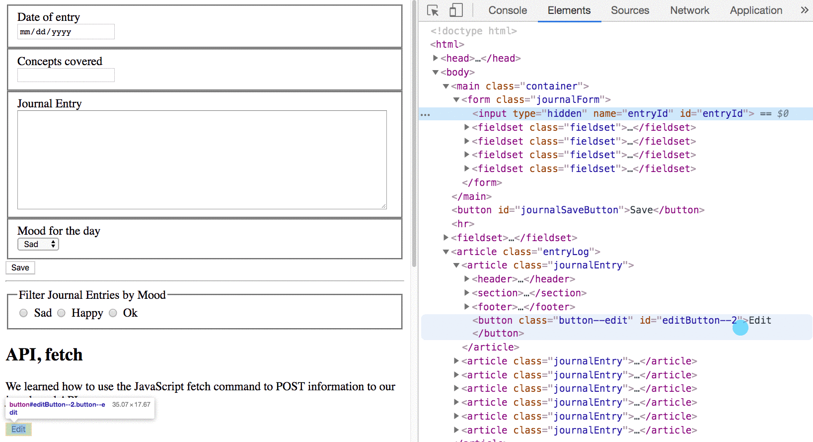

# Editing Entries

Editing data is the most complex operation to perform in a web application because you have to do the following steps.

1. Put an _Edit_ button on an HTML representation of a resource.
1. Add an event listener on that button.
1. Get the corresponding resource from the API.
1. Populate form input fields in the DOM to represent the current state of the resource.
1. Have an event handler on a button to allow the user to save changes.
1. Collect the user input from the DOM.
1. Send a request to the API to update the correct resource.
1. Render the updated HTML representation.



## Steps

1. Add edit button to journal entry form.
    ```html
    <button id="editEntry--${entry.id}">Edit</button>
    ```
1. Add hidden input field to the entry form to store `id` value of edited entry.
    ```html
    <input type="hidden" name="entryId" id="entryId">
    ```
1. In your **`EntryList`** component, add an event listener to edit button.
    ```js
    eventHub.addEventListener("click", clickEvent => {
        if (clickEvent.target.id.startsWith("editEntry--")) {
            const [notUsed, entryId] = clickEvent.target.id.split("--")

            /*
                Let all other components know that the user chose
                to edit an entry, and attach data to the message
                so that any listeners know which entry should be
                edited.
            */
            const message = new CustomEvent()
        }
    })
    ```
1. The **`EntryForm`** component is responsible for populating itself when the user clicks an edit button, so listen for your custom event.
1. In that listeners, use the `find()` method on your entries array to extract the one being edited.
    ```js
    const entryToEdit = entriesCollection.find(your_function_here)
    ```
1. Refactor your event listener for when the user clicks the save button. You now need to check if the hidden input field's value is `""` or an actual entry id.
    ```js
    const id = document.querySelector("#entryId")

    if (id === "") {
        // No id value, so POST new entry with `saveEntry()`
        // from data provider
    } else {
        // id value is there, so PUT entry with `updateEntry()`
        // from data provider
    }
    ```
1. Render all entries again
    ```js
    .then(() => {
        const updatedEntries = useEntries()
        render(updatedEntries)
    })