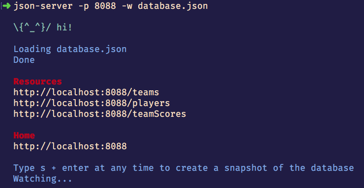

# Building Your Own Game API

In this chapter, you will be creating your own, local API which you will use to persist data for your Truncheons &amp; Flagons game application. You will be using an Open Source Software (OOS) package called `json-server` to run your API in a terminal session.

## Setup

### Install JSON Server

Open a terminal session. It doesn't matter what directory you are in because you are going to install some software _globally_, which means you can run it in your terminal in any directory.

Run the following command.

```sh
sudo npm i -g json-server
```

> **Explanation:** Because you are installing something globally, you need the `sudo`, which is developer-speak for "Run this command with administrative privileges". The `npm` is short for Node Package Manager, which is a public repository of OSS. The `i` is short for "install". The `-g` flag means global.

### Creating Your Database File

Go to your application directory.

```sh
cd ~/workspace/truncheons
```

Then create a directory named `api` and enter it.

```sh
mkdir api
cd api
```

Create your database file.

```sh
touch database.json
```

Create the base collections. You fill in the array with 1 sample team, 3 players for that team, and one game score for that team.

```json
{
    "teams": [],
    "players": [],
    "teamScores": []
}
```

## Starting Your Server

Then fire up your API with the following command.

```sh
json-server -p 8088 -w database.json
```

> **Explanation:** `json-server` starts the service to make the data available over HTTP. The `-p` flag lets you specify the port on which the service will listen. In this case, your API will respond to requests on `http://localhost:8088`. The `-w` flag tells json-server to reload the database whenever a change is made. It is short for "watch".

You should see the following output in your terminal.


