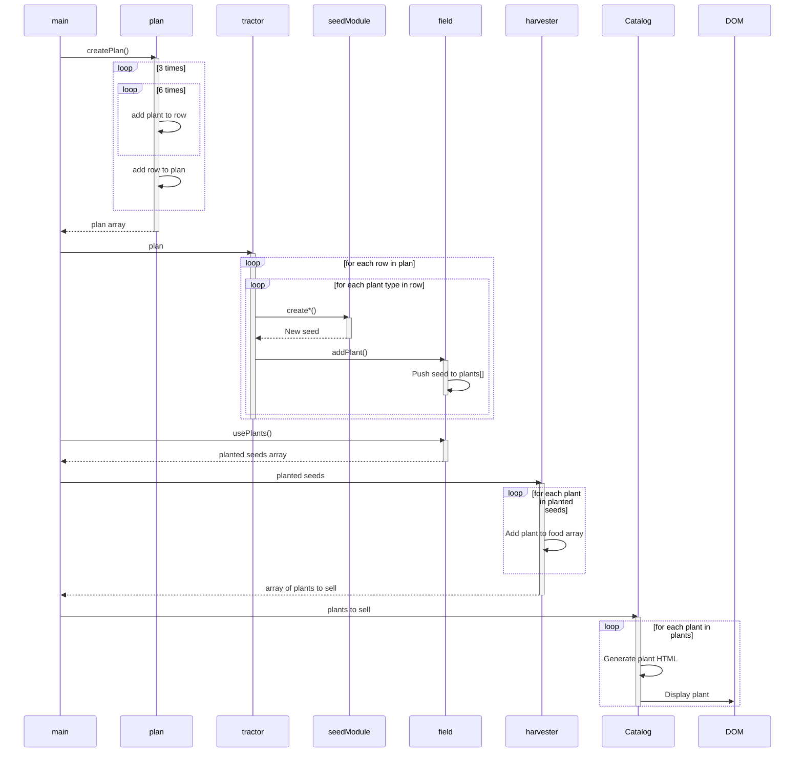

# Optional Challenges

Optional challenges are exactly that, optional. Your mentors will not expect that you have any of it done. It is for your own learning, curiosity and exploration. If you still have work to do in Martin's Aquarium or Daily Journal, then you probably shouldn't be here.

## Ordering the Harvest

Your first optional challenge is to display the list of food to be sold in alphabetical order. That is, all corn should be listed first, then all potatoes, then soybean, sunflower and wheat.

## Display Once With Quantity

Instead of displaying all object individually, show only one HTML representation of each plant type and display the quantity that you are selling of that type.

##### Example

| Food | Quantity |
|--|--|
|Corn| 22 |
|Potatoes| 16 |
|Wheat| 20 |

## Unique Identifiers

Add a unique, incrementing `id` property to each harvested plant. The first plant harvested should have an `id` value of 1. The second one should have a value of 2, etc.

* Which module creates objects that are harvested?
* How can you increase the numeric value of a variable by one?

## Emoji Food

Add an `icon` property to each of your seed objects so that the user can see a picture of the food.

## Sequence Diagram

Your team must generate a sequence diagram for this project.

Helpful hint if you're stuck

