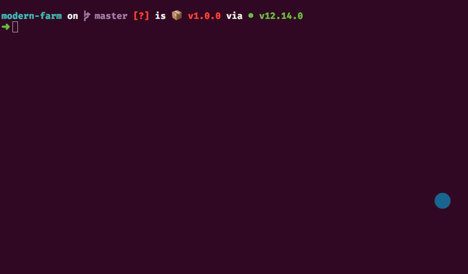
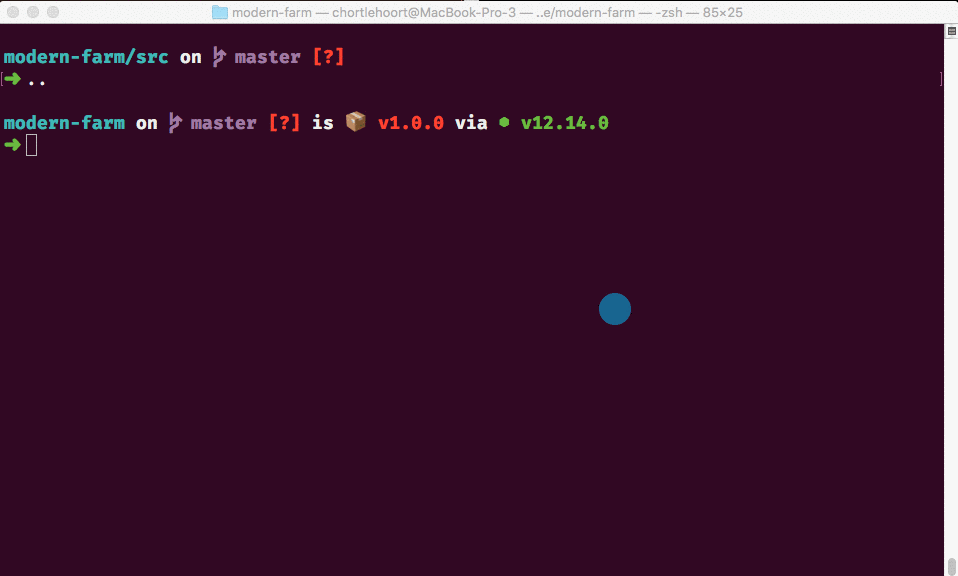

# Modern Farm Management


## Setup

Your mentors will provide a Github Classroom link that will create the Github repository. Make sure that the team follows the guidance provided in the [Github Workflow Guides](https://nashville-software-school.github.io/github-workflow/) during this project.

Once the team's repository has been made and everyone has joined the Github Classroom team, you will start with the [Begin a Project With Starter Code](https://nashville-software-school.github.io/github-workflow/START_REMOTE.html) process.

## Automated Tests

The next step is to get some tools installed. In your terminal, run the following command.

```sh
npm install
```

You will then see some required software to start getting installed. If you don't see this happening, or see an error, visit one of your mentors.


Once the process completes, then run the following command to start the automated tests.

```sh
npm run test
```

You should see the following output. Again, if you don't visit an mentor.



As you start to create the files, and then write the correct JavaScript code for this application, tests will start to pass. Make sure you come back to the terminal as you write code to see if your code works the way it is expected.

## Start Your Web Server

1. Keep your current terminal running, and open a new one so that you have two active terminals open.
1. In the new terminal session you created, make sure you navigate back to the `~/workspace/modern-farm` directory
1. Then use `cd` to navigate to the `src` sub-directory and start your web server.



## Creation of the Harvest Plan

There is an existing `plan.js` module in this application that is reponsible for defining 3 rows of crops to be planted. In each row, there are 6 plots of land. Each plot is randomly assigned one of the following types of food to grow.

1. Corn
1. Asparagus
1. Potato
1. Wheat
1. Sunflower
1. Soybean

In the `plan.js` module, there is a `createPlan()` function that is exported. In the `main.js` module, import that function and invoke it. Since that function returns a value, you need to store that value in a variable named `yearlyPlan`.

Remember that to assign what a function returns as a value of a variable, the syntax is...

```js
const appropriatelyNamedVariable = theFunctionThatReturnsAValue()
```

Use the **Sources** tab in your browser to set a breakpoint and verify that the value of this variable is the yearly planting plan.