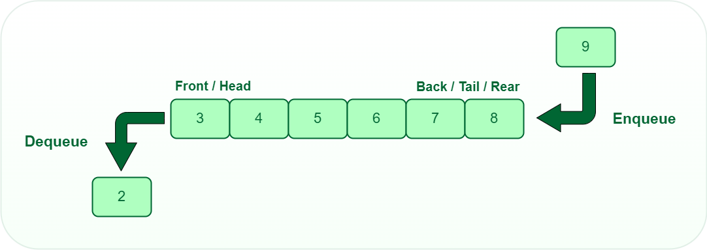

# Data Structure: The Queue

Now it is time to implement the food processing facility to produce consumer goods for the owners of the farm. The farmers will remove items from the storage barn and put them on a conveyor belt that transports items to a processing facility to producer higher-end goods.

## Queue Intro

Similar to Stack, **Queue** is a data structure that follows a particular order in which the operations are performed for storing data. The order is _First In First Out (FIFO)_.

One can imagine a queue as a line of people waiting to receive something in sequential order which starts from the beginning of the line. It is an ordered list in which insertions are done at one end which is known as the rear and deletions are done from the other end known as the front.

A good example of a queue is any queue of consumers for a resource where the consumer that came first is served first.

The difference between stacks and queues is in removing. In a stack we remove the item the most recently added; in a queue, we remove the item the least recently added.

## Key Operations on Stack Data Structures

- **enqueue()**: Inserts an element at the end of the queue _i.e. at the rear end_.
- **dequeue()**: This operation removes and returns an element that is at the front end of the queue.
- **isEmpty()**: This operation indicates whether the queue is empty or not.
- **size()**: This operation returns the size of the queue _i.e. the total number of elements it contains_.

## Algorithm Guidance

Your team needs to create a new module named **processingFacility.js**. In that module, create a function named `processor()`. This function must return an object with the following keys and values.

| Key | Value |
| --- | ----- |
|enqueue    | A function that accepts a crop that was removed from the storage barn as a parameter and adds it to the conveyor belt headed into the processing facility. |
|dequeue     | A function that accepts no parameters and returns the next crop on the conveyor belt to be processed. That crop is removed from the queue. |
|next    | A function that returns the name of the next crop that will be processed, but does not remove it from the conveyor belt. |
|last    | A function that returns the name of the last crop that was added to the conveyor belt. |
|isEmpty | A function that return a boolean. True if there are no crops on the conveyor belt. False if there are crops on the conveyor belt. |
|size    | A function that returns an integer representing the number of items currently on the conveyor belt. |

## Updating the Farm Algorithm

Now you will update the `main.js` module to have the storage barn and processing facility work in unison to produce the higher-end goods. Once all goods are processed, update your catalog to display all of the processed goods instead of raw crops.

### Constraints

- The conveyor belt queue can only hold 3 items at a time.
- The conveyor belt queue must always have at least 1 item on it until the storage barn has been emptied.
- The processing facility will start processing as soon as the conveyor belt is full.
- When an item is removed from the queue the corresponding processed good will be added to the Farm Store _(see table below)_.
- Once all crops have been removed from the Storage Barn and added to the queue, use `console.log()` to display the message **"Storage Barn is ready for new crops"**
- Once all crops have been processed, use `console.log()` to display the message **"Farm Store inventory is full and ready to open for business"**

### Processed Goods

| Crop | Processed good |
| --- | --- |
| Soybean | Bean paste |
| Corn | Corn meal |
| Sunflower | Sunflower Oil |
| Asparagus | Pickled asparagus |
| Wheat | Flour |
| Potato | Potato chips |
