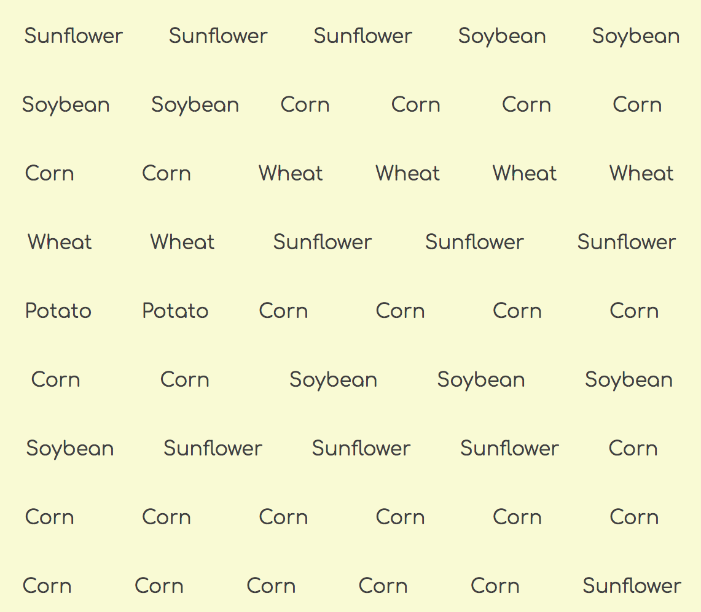

# Selling the Harvest Online

## Selling Instructions

You are a modern farm, so you want to put everything that you harvested on your farm's ordering web site so that buyers can access it from anywhere. To start, just list each of the plants in your harvest.

Use Flexbox to make a grid layout like below.



## Instructions

1. Create a `<main>` element in your `index.html` file. Make sure the element has a class of `container`.
1. Create a `scripts/catalog.js` module.
1. Define and export a `Catalog` function.
1. The Catalog function should accept the harvested food array as input.
1. The Catalog function should iterate the array of food objects.
1. As you iterate the array, the `<main>` element should have its inner HTML appended with an HTML representation of a food item. Use the following example for each food item. The example has Corn hard-coded. Yours should not. It should output the name property of the current food object.
    ```html
    <section class="plant">Corn</section>
    ```

#### Checking Your Logic

In the `main.js` module, invoke the Catalog function and make sure you pass the array of food as an argument. Make sure your web server is running and refresh the browser. Your DOM should look similar to the image above.

Please do not try to make it identical. Just make sure you are displaying them in a grid layout.

## Verifying that Your Code is Correct

Now that you have completed all of the tasks of running a modern farm, go back to the terminal and make sure that all of the automated tests are passing. You output should look like this:


