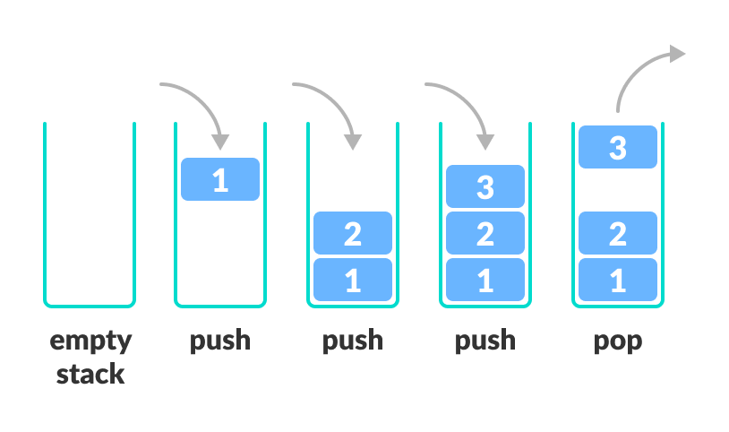

# Producing and Selling Processed Foods

The owners of the farm have realized that they can make more profit if they take their harvested plants and process them into higher-end consumer goods. They borrowed 2 million dollars from the bank to build two new buildings on the farm.

1. **Storage Barn** with one access door.
2. **Processing Facility** with equipment that can turn the raw plants into processed goods.

Your team's job is to update the software so that the farmers can automate this new system.

## Data Structure: The Stack

Since the Storage Barn only has one door, when the harvested plants are added, one by one, when the farmers want to remove one of the crops, then the last one added to the barn will be the first one that must be removed.

One of the most useful data structures that software developers use to simulate this kind of process is the **Stack**.



A Stack is a data structure that follows a particular order in which the operations are performed. The order may be _LIFO(Last In First Out)_ or _FILO(First In Last Out)_. **LIFO** implies that the element that is inserted last, comes out first and **FILO** implies that the element that is inserted first, comes out last.

Think of it this way:

- Pushing an element onto the stack is like adding a new plate on top.
- Popping an element removes the top plate from the stack.

## Key Operations on Stack Data Structures

- Push: Adds an element to the top of the stack.
- Pop: Removes the top element from the stack.
- Peek: Returns the top element without removing it.
- IsEmpty: Checks if the stack is empty.

## Algorithm Guidance

Your team needs to create a new module named **storageBarn.js**. In that module, create a function named `barn()`. This function must return an object with the following keys and values.

| Key | Value |
| --- | ----- |
|push    | A function that accepts a crop as a parameter and adds it to the storage barn |
|pop     | A function that accepts no parameters and returns the the last crop added to the barn |
|peek    | A function that returns the name of the last crop added to the barn |
|isEmpty | A function that return a boolean. True if there are no items in the barn. False if there are items in the barn. |

You have never implemented your own object method before, but you have definitely used them. For example, the `Array.push()` method. The array is the object which has a `push` key. It's value is a function.

Here's a simple example of how you can create objects that have both properties methods _(vocab: method is another word for a function, but that function is in the scope of an object)_ on them.

```js
const dog = (name) => {

    return {
        speak: () => {
            return `${name} barks and woofs.`
        },
        name: name,
        play: (toy) => {
            return `${name} chases the ${toy} around the house.`
        },
        legs: 4
    }

}

const lassie = dog("Lassie")

// play() is a method. This will output "Lassie chases the tennis ball around the house"
console.log( lassie.play("tennis ball") )

// Name is a property. This will output "Lassie"
console.log( lassie.name )

// speak() is a method. This will output "Lassie barks and woofs"
console.log( lassie.speak() )

// Legs is a property. This will output 4
console.log( lassie.legs )

// play() is a method. This will output "Lassie chases the big scary cat around the house"
console.log( lassie.play("big scary cat") )
```

## Storing the Harvest

Once you have this built, you must update your main algorithm to store all crops in the storage barn immediately after each one is harvested.

Then write some code in `main.js` that uses `console.log()` to display the contents of the barn. Then start removing crops from the barn, and occassionally `peek()` at the next crop to be removed.
