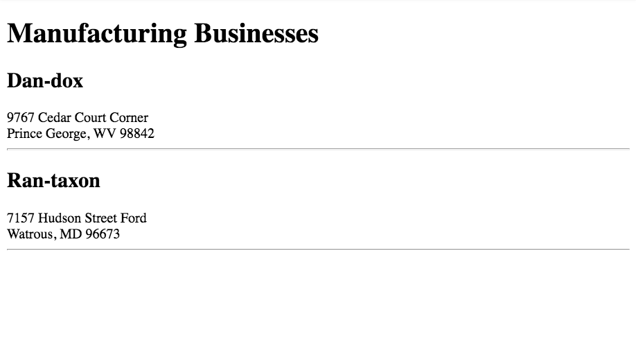

# Showing Different Kinds of Companies

Now you have code to show the businesses that have active accounts. You call Doris over and show her the results, and she's very excited.

> Doris leans forward in her seat, eyes bright, and exclaims, "Yes! This is exactly what I need!" She starts to scroll through all of the businesses, clearly enjoying her new toy.
>
> After several minutes of this, she abruptly stops and turns her head quickly in your direction, eyes wide. "You know, my regional manager, Barry has been asking me for something for months now. He has a new sales rep in New York and wants to check how many sales are being made in that state. So out of all these businesses, I need to see only the ones in New York."
>
> She turns her head towards the computer, narrows her eyes slightly and asks in a low voice, "Can you do that?"
>
> Unsure why she needed to ask in such a dubious manner, you confidently respond that you can. She smirks, takes out her cell phone, and walks back to her office while dialing a number...

For a task like this, the array `.filter()` method is perfect, because you need to look at each object in the businesses array, check to see if it meets Doris' condition, and if it does, place that object in a new array that only contains the businesses she wants.

The filter function creates a new array from the existing one, so you can invoke it and assign it to a new variable such as in the code below. The function that you pass to `.filter()` should return true or false. If it returns true, then the current item will be placed in the new array.

Here's an example of how you could filter an array of art supplies.

> **`just-for-show/scripts/exampleDatabase.js`**

```js
const database = {
  supplies: [
      {
          id: 1,
          price: 12.99,
          color: "Red",
          brand: "Bloomfield",
          type: "Paint"
      },
      {
          id: 2,
          price: 75.49,
          color: "Brown",
          brand: "Illinois Art",
          type: "Easel"
      },
      {
          id: 3,
          price: 19.99,
          color: "White",
          brand: "Emerson",
          type: "Oil Paint Canvas"
      }
  ]
}

/*
    Responsibility:
        Determine is a single supply costs less than $50

    Parameters:
        supply (object) - A single supply object representation

    Returns:
        (boolean) - True is item cost is less than $50, otherwise false
*/
const lessThanFifty = (supply) => {
    if (supply.price < 50.00) {
        return true
    }
    return false
}

/*
    Responsibility:
        Create and return a new array that contains
        supplies that cost less than $50

    Parameters:
        None

    Returns:
        (array) - Array containing inexpensive supply objects
*/
export const inexpensiveSupplies = () => {
    const filteredItems = supplies.filter(lessThanFifty)
    return filteredItems
}
```

## Videos With More Examples

You can watch some videos where other developers show you other examples of how to use the `.filter()` method on an array.

* [.filter() Array Method | JavaScript Higher Order Functions & Arrays](https://youtu.be/rRgD1yVwIvE?t=322)
* [JavaScript Array Filter](https://www.youtube.com/watch?v=4_iT6EGkQfk)

## Task: Listing New York Companies

1. Create a new module named `NewYorkBusinesses.js`
1. Build a function named the same inside it that uses `.filter()` to generate a list of companies located in New York (NY).
1. Invoke the function in the correct place in `main.js` to view your results on the DOM.

    

## Task: Listing Manufacturing Companies

1. Create a new module named `ManufacturingBusinesses.js`
1. Build a function named the same inside it that uses `.filter()` to generate a list of companies in the industry of "Manufacturing".
1. Invoke the function in the correct place in `main.js` to view your results on the DOM.

    
