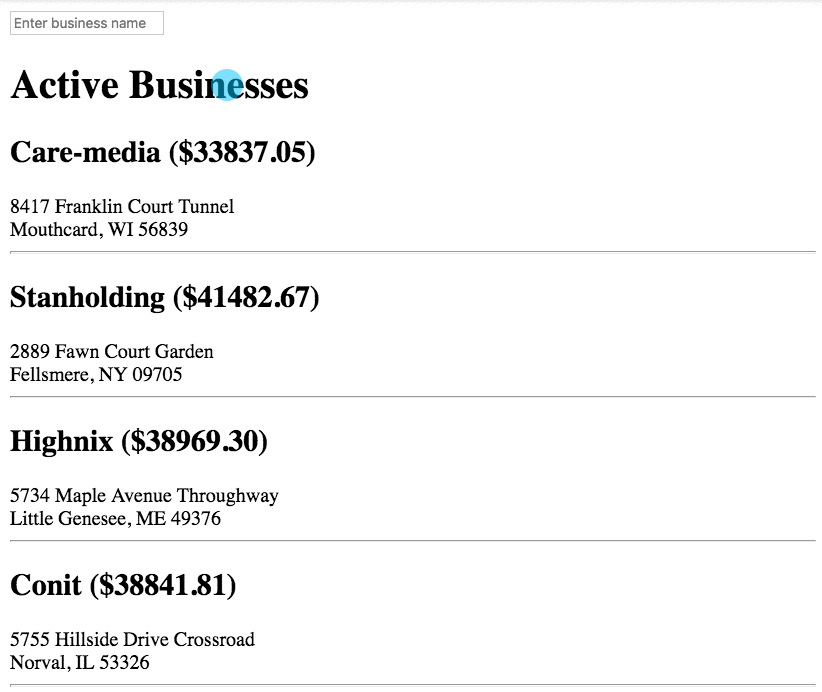

# Paper Customer Search

> You have been spending the morning backing up the hard drives that contain all the customer information to a cloud service. The unlocked desk drawer didn't seem an adequate corporate backup plan to you.
>
> As you watch your uploading progress bars, you notice with mild interest as Doris has been pacing her office for the last 45 minutes, clearly talking to someone on speaker phone. She doesn't appear to be angry, or even particularly agitated, just a bit nervous.
>
> You eventually need to use the restroom, and after a few minutes, you are returning to your desk and notice Doris waiting for you. She is sitting on the edge of your desk, staring out of one the windows that faces the faded parking lot at the side of the building. She looks distracted.
>
> As you grab your chair and slide it towards you so that you can go back to watching progress bars, she turns and smiles perfunctorily at you. As you sink into your chair, she stands up quickly and says, "I just got off the phone with our accountants. We needed to look at each of our customers and review their orders for this past year. It took forever because I kept needing to scroll through our massive list of customers until I found the one they needed."

As you consider this request, you realize that you'll need to provide Doris an input text field so that she can type in the name of a company. You will then need to take that search string, iterate the companies, and as soon as you find a match, display all the properties.

The `.find()` method on arrays is perfect this.

The method does exactly what it's name suggests. It iterates an array and as soon as it finds one item that passes the condition that you provide, it returns that item to you.

> **`just-for-show/scripts/exampleDatabase.js`**

```js
const database = {
    candies: [
        {
            name: "Lollipop",
            price: 2.99
        },
        {
            name: "Tootsie Roll",
            price: 1.49
        },
        {
            name: "Sugar Daddy",
            price: 2.49
        }
    ]
}

/*
    Responsibility:
        Find the FIRST candy that costs less than the
        specified amount

    Parameters:
        (number) - The maximum price for finding candy

    Returns:
        (object) - The first matching candy object
*/
export const findCandyBelowPrice = (priceCriteria) => {
    const matchingCandy = database.candies.find(candy => candy.price < priceCriteria)

    return matchingCandy
}
```

## Finding Businesses

To know when Doris is ready to _search_, you decide to capture the _keypress_ event. This will allow her to simply press the _"Enter"_ key to execute the search.




Add the following code to the **BusinessList** module.

> **`dothard-simbleton/scripts/BusinessList.js`**

```js

document
    .querySelector("#companySearch")
        .addEventListener(
            "keypress",
            (keyPressEvent) => {
                const companySearchResultArticle = document.querySelector(".foundCompanies")

                if (keyPressEvent.charCode === 13) {
                    /*
                        When the user presses 'Enter', find the matching business.


                        You can use the `.includes()` string method to
                        see if a smaller string is part of a larger string.

                        Example:
                            if (business.companyName.includes(keyPressEvent.target.value)) {

                            }
                    */

                    const foundBusiness = businesses.find(
                        // Your callback function goes here
                    )

                    companySearchResultArticle.innerHTML = Business(???);
                }
        });
```

## Videos With More Examples

You can watch some videos where other developers show you other examples of how to use the `.find()` method on an array.

* [ES6 Tutorial - How To Use JavaScript Array FIND Method](https://www.youtube.com/watch?v=PMRkx51LGSQ)
* [8 Must Know JavaScript Array Methods](https://youtu.be/R8rmfD9Y5-c?t=174)

## Task: Finding Purchasing Agents by First Name

Refactor your code to search for purchasing agents instead. If the search text is found in the first name of any purchasing agent, show that agent.

## Task: Finding Purchasing Agents by First or Last Name

Refactor your code so that if the search text is found in the first name, or last name, of any purchasing agent, show that agent.
