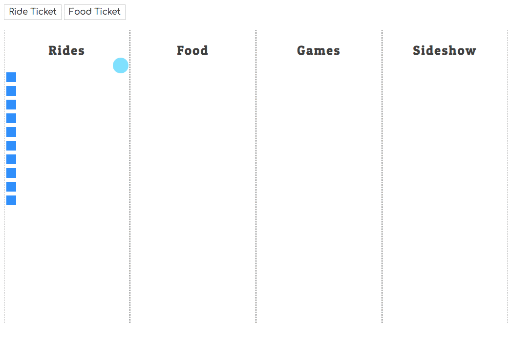

# Nom Nom Nom

Fair food is some of the best food on the planet. It's hard for anyone to resist the food vendors at a state fair. You need to record how many people buy food tickets.

## Listen for Custom Event

1. Create a new button in the ticket booth for people to buy food tickets.
1. Create a **`FoodTicketHolder`** component file, and add an event listener to the event hub that listens for the food ticket custom event that you will dispatch from the **`TicketBooth`** component.
1. In the body of the event listener callback function, add a new `
` element to the content target that has the correct classes on it (_see above_).
