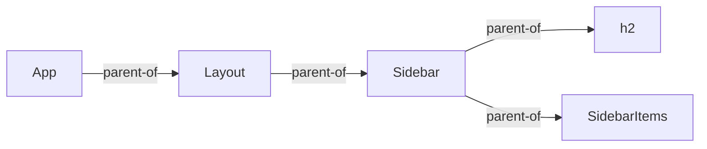
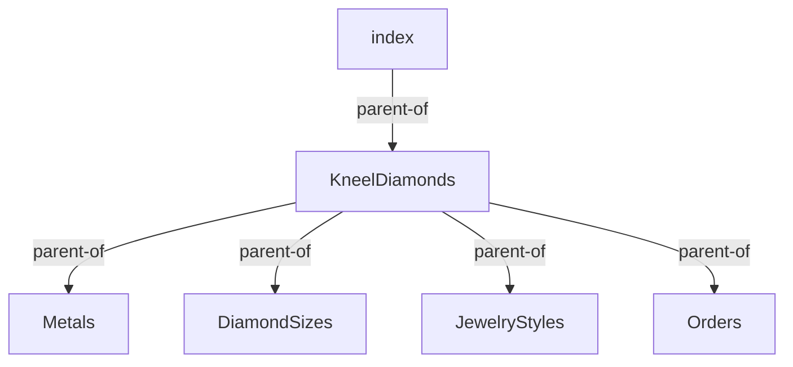

# Component Relationships

## Parent/Child

You can think of everything in React as a collection of parent child relationships. If a component invokes another component in its JSX, then you have a parent/child relationship. In the code example below, the **Layout** component is the parent, and the **Sidebar** is the child. Also, the **App** component is the parent of **Layout**.

```jsx
export const App = () => {

    return <Layout>
        <Sidebar />
    </Layout>
}
```

If the **Sidebar** component invokes another component, then you have another parent/child relationship. Look at the example code below.

```jsx
export const Sidebar = () => {

    return <>
        <h2>Items</h2>
        <SidebarItems />
    </>
}
```

You can visualize the components like this.




## Kneel Diamonds Component Diagram

