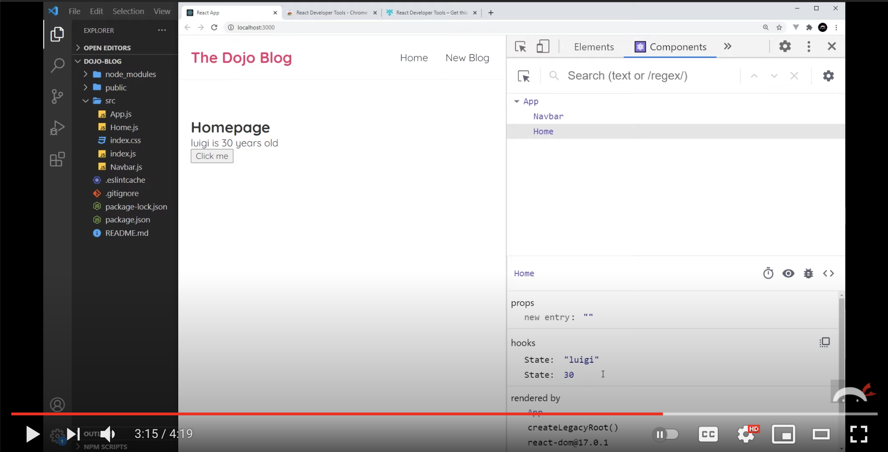

# Getting Started with React

React is a library that was open sourced by the development team at Facebook with the sole purpose of managing how data is displayed to the user. It doesn't care about the database, it doesn't care how data is retrieved, and it doesn't care about how complex the rest of the application is.

You've already learned the vast majority of what React does for you when building the UI for your application.

1. Building components and child components
1. Modular code with JavaScript modules
1. Updating the DOM with document elements or string templates
1. Setting the state of a component

## Installing React Developer Tools

You can install the React Developer Tools via the [Chrome Store](https://chrome.google.com/webstore/detail/react-developer-tools/fmkadmapgofadopljbjfkapdkoienihi).
You will get two new tabs in your Chrome DevTools:

* ⚛️ Components
* ⚛️ Profiler

These tools will help you debug and inspect your React applications.

## React Developer Tools

Watch the Intro to React Dev Tools video below to review their usage. Again, just like with VanillaJS, your use of the React dev tools is the only other way than using the debugger to gather evidence.

[](https://www.youtube.com/watch?v=rb1GWqCJid4)

## Creating the Application

Run the following commands to set up a new directory for a React project.

```sh
cd ~/workspace
npx create-react-app react-deshawn
cd react-deshawn
npm start
```

The process of building your React application will begin and the following things will happen.

1. Your browser will automatically open the `http://localhost:3000` URL.
1. You will see the following message in your terminal.
    ```sh
    Compiled successfully!

    You can now view honey in the browser.

      Local:            http://localhost:3000
      On Your Network:  http://192.168.68.105:3000

    Note that the development build is not optimized.
    To create a production build, use npm run build.

    webpack compiled successfully
    ```
