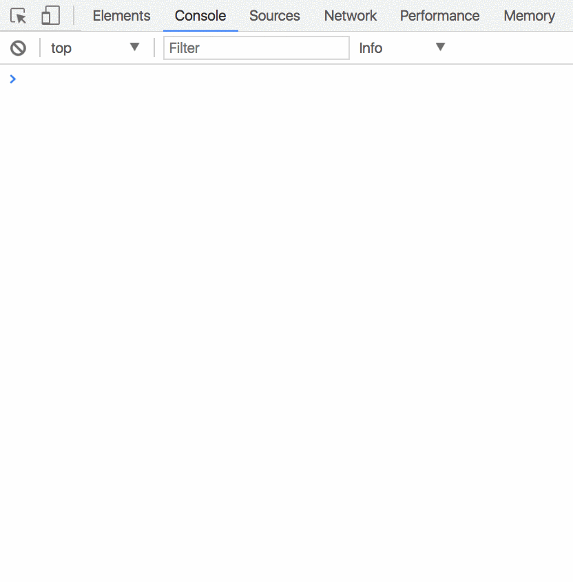

# Objects in JavaScript

Everything in JavaScript is an object. Well, except the 6 primitive types of string, symbol, integer, float, boolean, null, and undefined.

Everything **else** is an object.

Arrays? They're objects.

Functions? Yep, those two.

Classes? Sure, just fancy object definitions.

Want to see what JavaScript defines as an [Object](https://developer.mozilla.org/en-US/docs/Web/JavaScript/Reference/Global_Objects/Object)? Open Chrome, open the Developer Tools, go to the Console tab, type in `{}` and see what gets displayed. These functions will be available to any custom object that you define in your system that is linked to the base Object.



## Videos to Watch

1. [What's an Object in JavaScript?](https://www.youtube.com/watch?v=8iXoWC9XcU8)
1. [Objects and Prototypes In-depth 02 - Objects Basics](https://www.youtube.com/watch?v=yHkPHteghSc&index=2&list=PLqq-6Pq4lTTaflXUL0v3TSm86nodn0c_u)
1. [Objects and Prototypes In-depth 03 - Creating Objects](https://www.youtube.com/watch?v=25wlojU2mHg&index=3&list=PLqq-6Pq4lTTaflXUL0v3TSm86nodn0c_u)
1. [Object Keys](https://www.youtube.com/watch?v=cEVnlKgySsg)
1. [Javascript - How to Access Javascript Object Property Names Using A `for in` LOOP](https://www.youtube.com/watch?v=fDBuAnu0fvo)
1. [Modular Javascript - Prototypal Pattern vs Classical OOP in JS
](https://www.youtube.com/watch?v=doXpW5AD60Q)
1. [Object.create - Object Creation in JavaScript P6 - FunFunFunction #57](https://www.youtube.com/watch?v=CDFN1VatiJA)

# Practice

## Coins to Cash

```
mkdir -p ~/workspace/javascript/exercises/coins-to-cash && cd $_
echo '<html>
  <body>
    <script src="./coinsToCash.js"></script>
  </body>
</html>' > index.html
touch coinsToCash.js
code .
```


Define an object and store it in a variable named `piggyBank`. The object should have the following keys defined. 

* quarters
* nickels
* dimes
* pennies

For each coin type, give yourself as many as you like. 

```js
// I like pennies
const piggyBank = { pennies: 342 }
let dollarAmount = 0
```

Once you have given yourself a large stash of coins in your piggybank, look at each key and perform the appropriate math on the integer value to determine how much money you have in dollars. Store that value in a variable named `dollarAmount`.

When done, output the value to the browser console.

For example, if my piggy bank only held those pennies from above, when I type the variable name of `dolllarAmount` into the console, the output would be.

```
> dollarAmount
$3.42
```

## Cash to Coins

```
mkdir -p ~/workspace/javascript/exercises/cash-to-coins && cd $_
echo '<html>
  <body>
    <script src="./cashToCoins.js"></script>
  </body>
</html>' > index.html
touch cashToCoins.js
code .
```

Now do the reverse. Convert the dollar amount into the coins that make up that dollar amount. The final result is an object with the correct number of quarters, dimes, nickels, and pennies.

```js
const dollarAmount = 0.10
const piggyBank = {}

// Your magic code here

console.log(piggyBank)
```

That should produce the following output.

```js
{
  quarters: 0,
  dimes: 1,
  nickels: 0,
  pennies: 0
}
```

## Student Grades

```bash
mkdir -p ~/workspace/javascript/exercises/grades && cd $_
echo '<html>
  <body>
    <script src="./grades.js"></script>
  </body>
</html>' > index.html
touch grades.js
code .
```

## Requirements

Loop over an array of student grades (values from 50-100) and keep track of how many students get each grade in an object named `grades`.

* A score of 50-60 is an F
* A score of 61-70 is a D
* A score of 71-80 is a C
* A score of 81-90 is a B
* A score of 91-100 is an A

Start with array of random scores in your JavaScript

```js
const scores = [82, 71, 62, 95, 55, 98, 69, 72, 78, 84, 64, 58, 87, 60]
const grades = {} // You'll need to change this line of code

for (let i = 0; i < scores.length; i++) {
    /*
      If the score is greater than 90, increment grades.A by 1.

      You can use a series of `if/then` blocks, but you could
      also achieve this with a switch statement.
    */
}
```

Use `console.log()` to output the following criteria to the browser console.

1. How many of each grade? Accomplish this with a `for..in` loop.
1. What is the lowest score? Sort the array and find out.
1. What is the highest score?
1. Which grade had the most students achieve it? Use an `if` statment, and a `currentGradeCount` variable, in your `for..in` loop to see if the current grade's value is higher than the last one.
1. Which grade had the fewest students achieve it?
